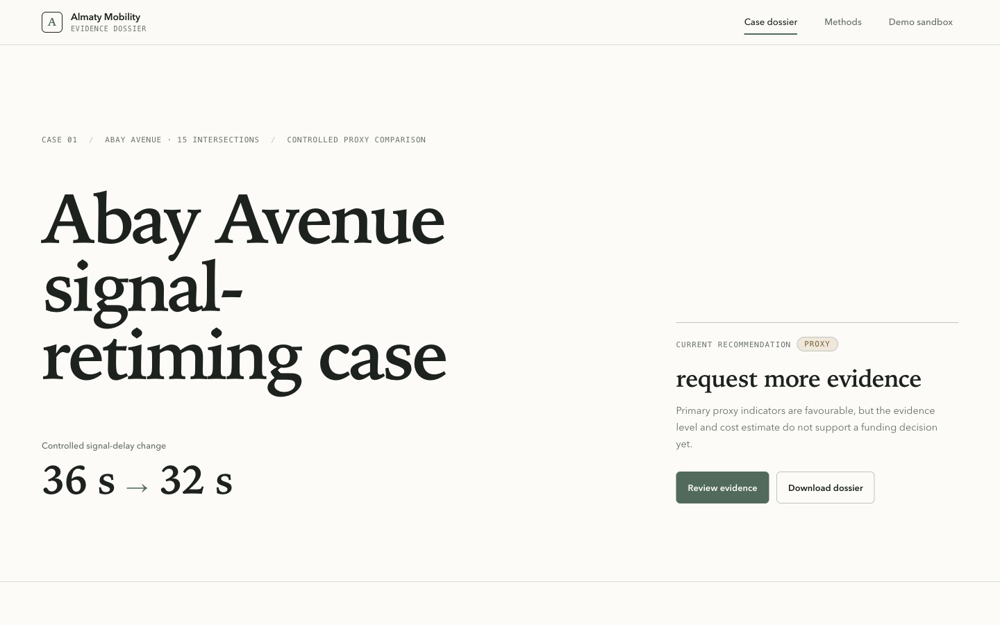
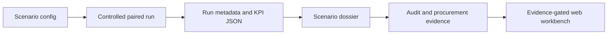

# Almaty Mobility Decision Workbench

University portfolio project by Kirill: a reproducible decision dossier for evaluating a signal-retiming scenario on Abay Avenue in Almaty.

The project is intentionally narrower than a city-wide “smart traffic” platform. It answers one reviewable question: **what evidence would be needed before a municipality could proceed with a proposed corridor intervention?**



> Current evidence boundary: the experiment and its KPI values are `proxy`; the workflow and procurement package are `demo`. Imported road geometry may be `real-data` by provenance, but that does not make the model calibrated. See [Validation status](README_VALIDATION.md).

## Problem And Project Outcome

Traffic dashboards often show maps and indicators without preserving how a decision was produced. This project keeps a reviewable evidence chain:



The portfolio case compares one baseline and one measure for Abay Avenue, generates the complete evidence pack in a single transaction, and exposes it through a Next.js dossier route. The interface shows KPI deltas, assumptions, limitations, source status, and permitted decision states; it does not pretend that a proxy result is ready for funding or field deployment.

## Author Contribution And Reviewable Scope

Kirill owns the project framing, the Abay corridor case, its evidence boundaries, and final review of the source and generated artifacts. The repository demonstrates an end-to-end piece of applied software engineering rather than a standalone chart:

- a versioned Python contract for a controlled baseline-versus-measure experiment;
- deterministic KPI and dossier generation with explicit assumptions and claim labels;
- schema and hash checks for reproducible evidence;
- an immutable release pack with atomic promotion of the current run;
- a TypeScript/Next.js evidence workbench for the Abay scenario;
- tests covering formulas, comparison controls, invalid inputs, recommendation gates, API safety, and responsive presentation;
- project governance through an Obsidian claim ledger and artifact registry.

Development uses AI-assisted review and testing. The contracts, source files, generated artifacts, and verification commands remain inspectable so a reviewer can evaluate the work independently.

Technology: Python 3.14.2, JSON Schema Draft 2020-12, Next.js 16, React 19, TypeScript, MapLibre/deck.gl, Playwright/axe, unittest, ESLint, and Docker Compose. See the [architecture](docs/ARCHITECTURE.md), [demo script](docs/DEMO_SCRIPT.md), and [portfolio case](docs/PORTFOLIO_CASE.md).

## Controlled Experiment

The showcased case is a bounded sensitivity proxy, not a calibrated traffic simulation. It changes only the signal-delay sensitivity input:

| Control | Baseline | Measure | Meaning |
|---|---:|---:|---|
| Signal-delay input | 36 s | 32 s | Proxy sensitivity inputs; not observed controller timings |
| Modeled demand | 500 vehicles | 500 vehicles | Same closed `aggregate-count-v1` KPI scale in both variants; not the source snapshot count |
| Seed and base analytics | shared | shared | Held constant |
| Context network fingerprint | shared | shared | Provenance only; `usedByModel: false` |

For signal-delay value `d`, the adapter uses:

```text
S(d) = affected_signals_per_trip × d × realization_factor
T(d) = R + S(d)
q(d) = T(d) / T(36)
```

The active assumptions are four affected signals per trip, a realization factor of `0.55`, and average vehicle occupancy `1.0`. The measure is always regenerated from the same unrounded baseline primitives. It is not produced by applying a percentage improvement to the baseline, and it does not claim OD-trip equivalence. The source analytics snapshot reports 1,950 active vehicles; that count is preserved as provenance but deliberately discarded as demand. Absolute person-hour and emissions proxy scale instead uses the independently declared aggregate count of 500. Proxy-v1 does not model how the source time/speed/congestion primitives would respond to that change of scale.

Full equations, bounds, rounding, demand identity, and recommendation rules are documented in [Methods](README_METHODS.md).

## Generated Result

These values were read from the paired-experiment and dossier JSON inside the promoted immutable portfolio run referenced by `reports/portfolio/current.json`:

| Metric | Baseline | Measure | Serialized delta | Claim |
|---|---:|---:|---:|---|
| Average trip time | 1663.46 s | 1654.66 s | -8.80 s | `proxy` |
| Congestion index | 55.59 | 55.30 | -0.29 | `proxy` |
| Person-hours per modeled peak window (occupancy 1.0) | 231.036 | 229.814 | -1.222 | `proxy` |
| Average corridor speed | 37.712 km/h | 37.913 km/h | +0.200 km/h | `proxy` |
| Queue/load proxy | 0.556 | 0.553 | -0.003 | `proxy` |
| Bus reliability proxy | 73.001% | 73.148% | +0.147 pp | `proxy` |
| CO2 proxy | 554.487 kg | 551.553 kg | -2.933 kg | `proxy` |
| NOx proxy | 1.386 kg | 1.379 kg | -0.007 kg | `proxy` |

The dossier classifies all six primary mobility directions as favorable (`M5_favorable_only`) but returns **`request_more_evidence`**, not fund. Economics are `E1_incomplete`: CAPEX `350,000,000 KZT` and annual OPEX `25,000,000 KZT` are placeholders; annual time-savings value is a `1,527,777.778 KZT/year` proxy, ROI is a placeholder-sensitive `-0.067`, and payback is unavailable.

The adapter calculates with unrounded primitives and serializes each field at its declared precision. Therefore, subtracting two displayed cells may differ from the serialized delta by `0.001`. The values above copy the artifact fields rather than recomputing them in this README.

## Five-Minute Local Setup

Prerequisites:

- macOS or Linux (POSIX filesystem semantics are required by the release transaction);
- Python 3.14.2;
- Node.js 20.20.0 and npm 10.8.2;
- Docker and Docker Compose only for the optional container path.

```bash
python3 -m venv .venv
source .venv/bin/activate
python -m pip install -e .
npm ci
npm run portfolio:bootstrap
npm run dev
```

Open [http://localhost:3000/scenarios/abay-signal-retiming/dossier](http://localhost:3000/scenarios/abay-signal-retiming/dossier).

`npm run portfolio:bootstrap` is the single public bootstrap command. It resolves Python from `TRAFFIC_SIM_PYTHON`, then `.venv/bin/python`, then `python3`; generates the full evidence DAG in staging; validates schemas, references, and hashes; and only then promotes `reports/portfolio/current.json`.

To select an interpreter explicitly:

```bash
TRAFFIC_SIM_PYTHON=.venv/bin/python npm run portfolio:bootstrap
```

For the exact Python dependency set used by isolated verification, replace the editable-install line in the quick start with:

```bash
python -m pip install -r requirements.lock
python -m pip install --no-deps -e .
```

`requirements.lock` was generated on Python 3.14.5. The package itself supports Python 3.11+; a lock generated on one Python release is repeatable evidence for that environment, not a promise that every pinned wheel is available on every supported interpreter/platform combination.

### Docker

The production image generates its own immutable evidence pack from the clean build context:

```bash
docker compose up --build app
```

Open [http://localhost:3000/scenarios/abay-signal-retiming/dossier](http://localhost:3000/scenarios/abay-signal-retiming/dossier). Windows is not a supported direct-bootstrap platform in this release; use a Linux environment or Docker.

## Verification

Run the same checks used for the portfolio review:

```bash
PYTHONDONTWRITEBYTECODE=1 PYTHONPATH=src .venv/bin/python -m unittest discover -s tests -v
TRAFFIC_SIM_PYTHON=.venv/bin/python npm run portfolio:bootstrap
npm run lint
npx tsc --noEmit --pretty false --incremental false
npm run build
PYTHONPATH=src .venv/bin/python scripts/verify_portfolio_determinism.py --repository-root .
npm run verify:public-routes
docker compose config
```

The bootstrap itself validates the paired-experiment and route-manifest schemas, logical paths, and SHA-256 hashes before it changes the current-run pointer. Re-running it should preserve the experiment's semantic fingerprint and a canonically identical KPI block while timestamps and release IDs may change.

The canonical release gate is `npm run verify:release -- --stage candidate`. It is intentionally read-only and requires a clean committed checkout; the workspace shown here remains a development worktree and is not release proof. A clean candidate additionally runs the isolated two-run comparator, production browser/API smoke and runtime dependency audit.

Environment used for the latest local documentation review:

| Tool | Version |
|---|---|
| macOS | 26.3 |
| Python (project virtual environment) | 3.14.2 |
| Node.js | 20.20.0 |
| npm | 10.8.2 |
| Docker Engine | 29.5.3 |
| Docker Compose | 5.1.4 |

Passing checks and tool availability are not calibration evidence. See [Validation status](README_VALIDATION.md) for that distinction.

## Project Map

| Path | Responsibility |
|---|---|
| `simulation.config.json` | Canonical Abay reproduction configuration |
| `requirements.lock` | Exact Python dependency set used by isolated verification |
| `data/fixtures/abay/` | Compact, declared proxy inputs and provenance |
| `src/traffic_sim/paired_experiment.py` | Versioned controlled-pair contract and signal-delay adapter |
| `src/traffic_sim/executive_kpis.py` | KPI formulas and decision-factor classification |
| `src/traffic_sim/dossier.py` | Scenario dossier construction |
| `src/traffic_sim/portfolio_release.py` | Staging, validation, immutable run, and atomic promotion |
| `scripts/bootstrap_portfolio.py` | Canonical portfolio bootstrap entry point |
| `schemas/` | JSON contracts for paired results and promoted manifests |
| `src/app/scenarios/abay-signal-retiming/dossier/` | Portfolio workbench route |
| `reports/portfolio/current.json` | Pointer to the promoted immutable evidence run |
| `docs/obsidian/` | Goals, claim ledger, artifact registry, and agent handoffs |

## Limitations

- The signal-delay adapter is a transparent aggregate-count proxy, not a calibrated network or controller model.
- The 36 s and 32 s values are sensitivity inputs, not measured signal plans.
- Aggregate demand count does not represent OD routes, turning movements, lane changes, or queue propagation.
- Source time/speed/congestion primitives come from a snapshot reporting 1,950 active vehicles, while absolute KPI scale uses a separate 500-vehicle aggregate control; proxy-v1 does not simulate demand-response scaling between them.
- Person-hours and time-value use an explicit average vehicle occupancy proxy of `1.0`, not an observed Almaty occupancy estimate.
- The context road-network fingerprint is traceability metadata and is not used causally by proxy-v1.
- Speed, queue, bus reliability, emissions, time savings, ROI, and payback remain formula-based proxies.
- Cost inputs remain placeholders unless a generated artifact explicitly marks them otherwise.
- Imported/cached geometry can have real-source provenance while the model remains uncalibrated.
- Decision controls are evidence statuses; there is no authenticated approval, signature, or municipal system of record.
- The app is a local portfolio/review build, not a production deployment, live feed, or procurement acceptance package.
- The direct Next.js advisory chain was cleared by updating to 16.3.0, but the 2026-08-11 production dependency audit still reports eight high-severity transitive findings in the `@deck.gl/geo-layers` 3D/texture-loader chain. Resolve or replace that dependency before public deployment.
- Public clean-clone reproducibility remains a release gate until the curated source slice is authorized and committed.

## Further Reading

- [Methods and reproducibility](README_METHODS.md)
- [Validation status and future protocol](README_VALIDATION.md)
- [Procurement-readiness gaps](docs/procurement_readiness.md)
- [Data-source boundaries](docs/data_sources.md)
- [Claim Ledger](docs/obsidian/03-registries/Claim%20Ledger.md)
