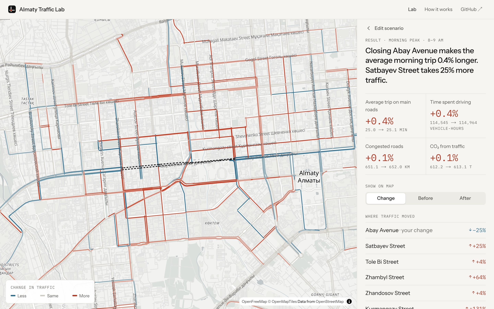
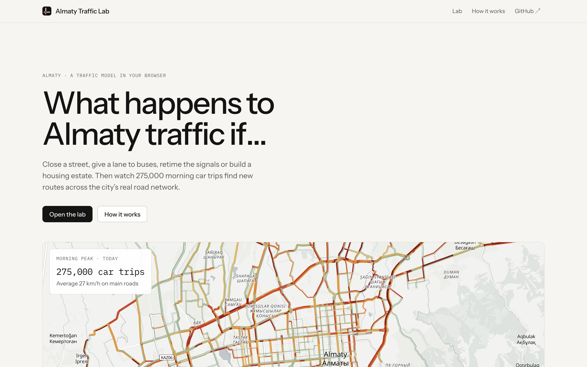
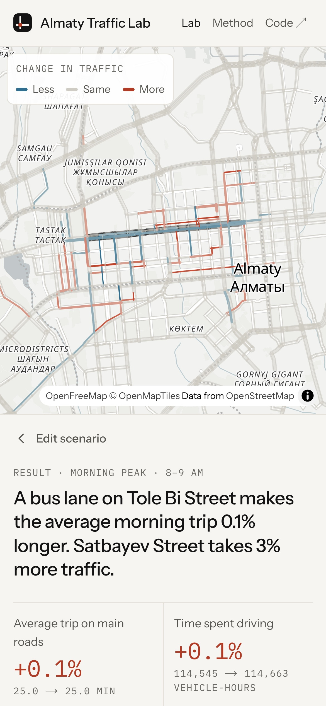
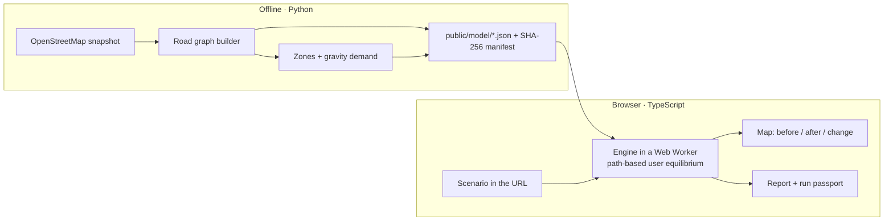

# Almaty Traffic Lab

**Pick any street in Almaty, change it, and see how city traffic redistributes.**
A traffic-assignment model of the city's real road network that runs entirely in your browser.

**Live demo:** _link added after the first deployment_ (the **How it works** page there explains the method in plain English)



## Try it in three clicks

1. Open the demo and choose **“Abay Avenue closes for repairs”**.
2. Look at the map: the dashed line is the closed road, red streets take the diverted cars, blue ones get quieter.
3. Click **Full report** for the numbers, the assumptions and a run fingerprint you can reproduce.

Then make your own: click any coloured road, pick *Close for repairs*, *Give a lane to buses*, *Widen by one lane*, *More green at signals* or *Lower the speed limit*, or place a new housing estate, office cluster or mall anywhere on the map. Every scenario lives in the URL, so it can be shared.

## What it does

| | |
|---|---|
| **Real streets** | 3,505 junctions, 6,871 one-way road links and 665 traffic signals of Almaty’s main road network, built from an OpenStreetMap snapshot (April 2026) with lanes, speed limits and English street names. |
| **Estimated demand** | 275,000 morning-peak car trips between 135 zones, from a gravity model on homes (residential street length) and jobs (street length, boosted towards the centre). |
| **Equilibrium routing** | Every driver takes the fastest route given everyone else’s choices (Wardrop user equilibrium, BPR travel-time curves, Webster signal delay), solved by path-based gradient projection. |
| **Instant scenarios** | A change starts from today’s routes, so only affected trips move: results in about a second on a laptop, in a Web Worker, with no server. |
| **Honest output** | Plain-English headline, city-wide metrics, streets that gained or lost traffic, and a “How much to trust this” note that separates real data from estimates. |
| **Reproducible** | Data files are rebuilt byte-for-byte from the snapshot and listed with SHA-256 hashes; the engine is deterministic across browsers, so the same link gives the same result hash. |

<p align="center">
  
  
</p>

## Architecture



| Path | What lives there |
|---|---|
| `scripts/lab/` | Graph builder, demand model, plausibility calibration, baseline and manifest generation |
| `public/model/` | The city model the browser loads (graph, demand, calibration, baselines, manifest) |
| `src/lab/engine/` | Traffic engine: graph, Dijkstra, path-based solver, conjugate Frank–Wolfe reference, interventions, metrics, hashing |
| `src/lab/client/` | Web Worker, data loading, shared engine client |
| `src/components/lab/`, `src/app/` | Next.js pages: home, lab, report, methods |
| `tests/` | Engine tests (Vitest), data rebuild tests (Python), visitor-flow e2e + accessibility (Playwright, axe) |
| `src/traffic_sim/` | Earlier iteration: Python agent-based simulator and the Abay signal-retiming dossier pipeline ([archive](archive/abay-dossier/README.md)) |

## Run it locally

Requires Node.js 22 and, only for rebuilding the data, Python 3.11+.

```bash
npm ci
npm run dev
```

Open http://localhost:3000.

Rebuild the model from the OpenStreetMap snapshot:

```bash
npm run lab:data && npm run lab:artifacts
```

## Tests

```bash
npm run test:engine                                   # 16 engine tests: equilibrium, interventions, determinism, speed
python3 -m unittest tests/test_lab_data.py            # data rebuilds byte-for-byte
npm run build && npm run start -- -p 3100             # then, in another terminal:
BASE_URL=http://localhost:3100 node tests/e2e/visitor-flow.mjs
```

The engine tests check, among other things, that the path-based solver agrees with an independently written conjugate Frank–Wolfe solver, that closing a road moves its traffic onto parallel streets, that extra green for one street costs the crossing streets, and that a no-change scenario leaves the city where it was.

## Limits

- Demand is estimated, not surveyed, and the model has not yet been checked against measured travel times.
- Only cars on main roads; buses, residential streets and parking are not modelled.
- A static peak-hour model: it does not show queues building and clearing minute by minute.
- Use it to compare scenarios. Do not read the numbers as forecasts.

## Credits

Built by Kirill. Road data © [OpenStreetMap contributors](https://www.openstreetmap.org/copyright) (ODbL). Basemap by [OpenFreeMap](https://openfreemap.org) / OpenMapTiles. Code under the [MIT licence](LICENSE).
