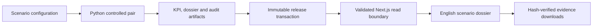

# Architecture

## Purpose and boundary

This repository is an artifact-centred modular monolith for one bounded case: a proposed signal-retiming intervention on Abay Avenue in Almaty. It is not a live traffic-control service. Its public result remains a `demo` workflow around `proxy` model outputs.



## Components

- Python in `src/traffic_sim/` is the sole generation authority. It builds the paired experiment, KPIs, dossier, workflow, procurement, provenance, and immutable release directory.
- `scripts/bootstrap_portfolio.py` performs the transaction: generate under staging, validate schemas/hashes/references, atomically promote an immutable run, then update compatibility aliases.
- `reports/portfolio/current.json` is the promoted pointer. Compatibility aliases are never runtime authority.
- Next.js reads only the promoted or explicitly requested immutable run through `src/components/dossier/portfolioRelease.ts`. It validates route manifests, source records, run bindings, paths, sizes and SHA-256 hashes before rendering or downloading an artifact.
- The dossier route is an evidence presentation boundary. It formats serialized values but never computes KPIs, chooses claim levels, merges runs, or creates a production release.
- The sandbox is a separately labelled interactive demo. It does not provide authoritative dossier values.

## Trust boundaries and ADRs

1. Scenario configuration, paired result, run passport, KPIs, dossier, route manifest, download allowlist, and release provenance are closed contracts. Unknown or missing trust-boundary fields are rejected.
2. Logical paths are normalised, bound to one immutable run and rechecked against file metadata before read/stream operations. Symlinks, traversal, mutable-root fallbacks and mixed-run artifacts fail closed.
3. Production GET routes are read-only. Generation endpoints return deterministic `404` in production before a process can start.
4. Browser code is not an evidence authority. It cannot upgrade a claim or convert a proxy result into a funding decision.
5. The promoted release binds source hashes, artifacts, toolchain pins, and the release run ID. Candidate verification separately proves Git identity and two-run semantic determinism.

## Deployment shape

The container has distinct Python evidence-generation, Node build, production-dependency, and non-root runtime stages. Both Node and Python bases are digest pinned in `Dockerfile`. The final image includes a verified evidence pack, production Node dependencies, and a health check against the dossier API. Compose deliberately does not bind-mount mutable reports or source data.

Actual image/SBOM/CVE evidence remains a release gate, not an architectural claim, until the digest-pinned container scans complete.

## How to verify

From a clean candidate checkout, install the pinned toolchains and run:

```bash
npm run verify:release -- --stage candidate
```

The command is read-only: it checks the Git state, source and current manifests, Python/frontend contracts, isolated determinism, production public-route/browser smoke, and the runtime dependency threshold. See [Methods](../README_METHODS.md) and [Validation](../README_VALIDATION.md) for model and claim limits.
