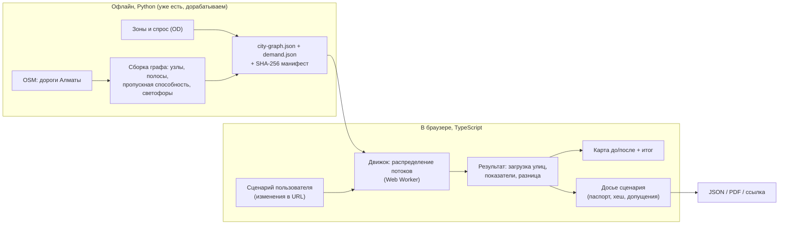

# План доработки: Almaty Traffic Lab

Статус: черновик на согласование · 2026-10-06

## 1. Цель

Превратить проект из готового отчёта по одному кейсу (проспект Абая) в **открытую лабораторию**. В ней любой человек без подготовки выбирает улицу или точку на карте Алматы, задаёт изменение и за несколько секунд видит, что произойдёт с трафиком в городе. Результат подаётся понятным языком, вместе с честной оценкой того, насколько ему можно доверять.

**Критерий успеха:** член приёмной комиссии открывает ссылку из резюме, за 3 минуты без инструкций проводит свой эксперимент и понимает результат. Ничего не нужно устанавливать, ничего не ломается, ничего не ждёт «прогрева сервера».

### Что меняется в концепции

| Было | Станет |
|---|---|
| Один зафиксированный кейс: светофоры на Абая, 36 → 32 с | Любая улица или точка, несколько типов изменений |
| Мы выбираем проблему за пользователя | Пользователь выбирает сам; есть готовые «примеры задач» для быстрого старта |
| Длинный текстовый отчёт на главной | Сначала карта и действие, отчёт по запросу |
| Язык закупок и акимата (procurement, claim level) | Простой язык: «стало хуже / лучше», «насколько этому верить» |
| Аналитика песочницы на случайных числах | Настоящая (пусть упрощённая) транспортная модель с причинно-следственной связью |
| Симуляция на сервере через Python | Модель считается прямо в браузере: мгновенно, бесплатно, работает годами без поддержки |

Сохраняется главная идея проекта, его отличие от «красивой карты»: **каждый результат проверяем и честно маркирован**. Цепочка `сценарий → запуск → показатели → досье → доказательства` остаётся. Теперь её строит сам пользователь для своего сценария.

## 2. Пользовательский флоу

### Шаг 0. Вход (главная, `/`)

```
┌──────────────────────────────────────────────────────────────┐
│ Almaty Traffic Lab                          RU | EN   О модели│
├──────────────────────────────────────────────────────────────┤
│  Что будет с трафиком Алматы, если…                          │
│  [ Выбрать улицу на карте → ]                                │
│                                                              │
│  Или начните с примера:                                      │
│  ┌──────────────┐ ┌──────────────┐ ┌──────────────┐          │
│  │ 🚧 Абая на   │ │ 🚌 Выделенка │ │ 🏢 Новый ЖК  │          │
│  │ ремонте      │ │ на Толе би   │ │ на 3000 кв.  │          │
│  └──────────────┘ └──────────────┘ └──────────────┘          │
│  [ карта города с текущей загрузкой улиц, живая анимация ]   │
└──────────────────────────────────────────────────────────────┘
```

Человек за 5 секунд понимает, что это и что делать. Пример открывает лабораторию с уже применённым изменением, и можно сразу нажать «Запустить».

### Шаг 1. Выбор места (`/lab`)

- Карта на весь экран, улицы окрашены по загрузке (зелёный → красный).
- Время суток: Утро · День · Вечер · Ночь. Это меняет спрос.
- Клик по улице подсвечивает её и открывает карточку: название, сколько машин в час, загрузка в процентах.
- Клик по пустому месту ставит точку (нужно для сценария «построить объект»).

### Шаг 2. Выбор изменения

Карточка улицы показывает действия обычными словами:

| Кнопка | Что меняется в модели |
|---|---|
| 🚧 Перекрыть на ремонт | Пропускная способность участка → 0 |
| 🚌 Отдать полосу под автобусы | −1 полоса для машин |
| ➕ Расширить на полосу | +1 полоса |
| 🚦 Больше зелёного на светофорах | Меньше задержка на перекрёстках улицы |
| 🐢 Снизить скорость до 40 км/ч | Меньше скорость свободного потока |

Для точки: 🏢 **Построить ЖК / ТЦ / офис** с ползунком размера. Это добавляет поездки из этой точки и в неё.

Изменения можно комбинировать. Они собираются в список «Ваш сценарий» с кнопками удаления и «Сбросить».

### Шаг 3. Запуск

Кнопка **«Посмотреть, что будет»**. Расчёт идёт 1–3 секунды в фоне (Web Worker), интерфейс не замирает. Индикатор показывает этапы: «Строим маршруты… Распределяем потоки…».

### Шаг 4. Результат

```
┌───────────────────────────────┬──────────────────────────────┐
│  [карта: разница ДО / ПОСЛЕ]  │ Итог                         │
│  красный — стало загруженнее  │ Средняя поездка: 24.1 → 25.3 │
│  зелёный — разгрузилось       │ мин (+5%)                    │
│  ◀ ДО ─────●───── ПОСЛЕ ▶     │ Машино-часы в пике: +3 200   │
│                               │ CO₂: +4%                     │
│                               │                              │
│                               │ Куда ушли машины:            │
│                               │ 1. Сатпаева      +38% ▲      │
│                               │ 2. Жандосова     +21% ▲      │
│                               │ 3. Тимирязева    +17% ▲      │
│                               │                              │
│                               │ Насколько этому верить? ●●○○ │
│                               │ [Подробный отчёт] [Ссылка]   │
└───────────────────────────────┴──────────────────────────────┘
```

- Ползунок «до / после» на карте. Это самый наглядный момент: видно, как перекрытие одной улицы «перекрашивает» соседние.
- Итог одной фразой: «Перекрытие Абая увеличит среднюю поездку на 5% и перегрузит Сатпаева и Жандосова».
- **«Насколько этому верить?»** — упрощённый evidence gate из нынешнего проекта. Он объясняет: модель упрощённая, данные о спросе оценочные, реальными замерами не сверено. Это сохраняет научную честность проекта, и её видно с первого экрана.

### Шаг 5. Досье и ссылка

- **«Подробный отчёт»** открывает досье *своего* сценария на текущих компонентах (таблица показателей, допущения, ограничения, паспорт запуска). Его можно скачать в JSON или распечатать в PDF.
- **«Скопировать ссылку»**: сценарий хранится в URL (`/lab?s=…`). Та же ссылка даёт тот же результат и тот же отпечаток SHA-256. Это и есть воспроизводимость: член комиссии может переслать свой эксперимент коллеге.

### Шаг 6. «О модели» (`/methods`)

Одна страница простым языком: как устроена модель, откуда данные, что она не умеет. В конце формулы и ссылка на GitHub.

## 3. Архитектура



### Модель: статическое распределение транспортных потоков

Классический метод транспортного планирования. Он простой, объяснимый и даёт честную причинно-следственную связь: перекрыли улицу — машины перестроили маршруты — соседние улицы загрузились.

1. **Граф.** Около 2 400 участков магистральных и районных улиц Алматы из OSM (trunk / primary / secondary). Полосы и скорость берутся из OSM. Пропускная способность считается как полосы × норматив по типу дороги. На перекрёстках со светофорами добавляется задержка.
2. **Спрос.** Город делится на 40–60 зон (сейчас их 7, этого мало). Поездки между зонами считаются по гравитационной модели с весами по времени суток (утро / день / вечер / ночь). Спрос помечен как оценочный (`proxy`).
3. **Время проезда** по функции BPR: `t = t₀ · (1 + 0.15 · (поток/пропускная)⁴)`.
4. **Распределение** методом последовательных средних (MSA) или Франка–Вульфа: каждая поездка ищет самый быстрый путь (Дейкстра), итерации идут до равновесия. На графе такого размера это меньше 1–2 с в браузере.
5. **Показатели:** среднее время поездки, машино-часы, загрузка улиц, CO₂ / NOx (через машино-часы и пробег), список улиц с наибольшим изменением.

### Почему в браузере, а не на сервере

- Бесплатный сервер с Python засыпает: первый запрос ждёт 30–60 с. Член комиссии решит, что сайт сломан.
- Браузерный расчёт мгновенный, бесплатный (статический хостинг на Vercel) и будет работать через год, когда заявку будут рассматривать.
- Python остаётся там, где он силён: подготовка данных, канонический воспроизводимый релиз и тесты.

### Что происходит с текущим кодом

| Компонент | Решение |
|---|---|
| Python: OSM-загрузка, граф, зоны | **Оставить и доработать**: экспорт `city-graph.json` и `demand.json` |
| Python: релиз-конвейер (схемы, хеши, атомарный релиз) | **Оставить**: собирает и проверяет данные для движка |
| Кейс Абая (proxy-формулы) | **Перевести** в один из «примеров задач» на новом движке; старый отчёт оставить в репозитории как методологию |
| Компоненты досье (`KpiDeltaTable`, `EvidenceGate`, `RunPassportCard`, `ClaimBadge`) | **Переиспользовать** для досье пользовательского сценария |
| `TrafficMap.tsx` (4 000 строк) и API на `execFile python3` (`/api/trips`, `/api/analytics`, `/api/physics`) | **Заменить**: не работают на хостинге, аналитика случайная |
| Закупки, акимат, workflow, operations (API и UI) | **Убрать из публичного интерфейса**, код оставить |
| Дизайн-система (`DESIGN.md`, шрифты, палитра) | **Оставить**: выглядит профессионально |

## 4. Этапы работ

Приоритеты: **P0** обязательно до подачи, **P1** сильно улучшает, **P2** по желанию.

### Этап 0 — Гигиена репозитория · P0 · S

- [ ] Закоммитить текущие рабочие изменения (82 файла) отдельным коммитом.
- [ ] Удалить мусор из корня: `Untitled*.canvas`, `Untitled*.base`, `2026-05-17.md`, `test_osmnx_tags.py`, `.DS_Store`; убрать `tsconfig.tsbuildinfo` и `test-results/` из git.
- [ ] Проверить, что в истории git нет секретов и тяжёлых файлов (`cache/` 60 МБ, `reports/` 71 МБ). Решить, что из этого публиковать.
- [ ] Выбрать лицензию (MIT).

**Готово, когда:** `git status` чистый, корень репозитория читается с первого взгляда.

### Этап 1 — Данные города и движок · P0 · L

- [ ] Python: экспорт графа в компактный `public/data/city-graph.json` (узлы, рёбра, полосы, пропускная способность, светофоры, названия улиц) с привязкой концов участков и проверкой связности (берём крупнейшую связную компоненту).
- [ ] Python: 40–60 зон спроса и матрица поездок по 4 периодам суток → `demand.json`.
- [ ] Манифест данных с SHA-256 (переиспользуем релиз-конвейер).
- [ ] TypeScript: движок `src/engine/` — граф, Дейкстра на бинарной куче, BPR, MSA / Франк–Вульф, показатели.
- [ ] Типы изменений: перекрытие, ± полоса, светофор, скорость, новый объект (спрос в точке).
- [ ] Web Worker-обёртка с прогрессом.
- [ ] Тесты движка (`node --test`): сходимость, сохранение числа поездок, «перекрытие → поток уходит на соседние улицы», детерминизм (тот же вход → тот же хеш), время расчёта < 2 с.

**Готово, когда:** перекрытие Абая в тестах детерминированно перераспределяет поток на параллельные улицы, а расчёт укладывается в бюджет времени.

### Этап 2 — Интерфейс лаборатории · P0 · L

- [ ] Главная `/`: заголовок-вопрос, 3–4 «примера задач», карта с живой загрузкой.
- [ ] `/lab`: карта (MapLibre + deck.gl), выбор времени суток, клик по улице или точке → карточка действий, список «Ваш сценарий».
- [ ] Запуск в Worker, индикатор этапов.
- [ ] Результат: карта разницы, ползунок до / после, итог одной фразой, топ-5 изменившихся улиц, «Насколько этому верить?».
- [ ] Сценарий в URL и кнопка «Скопировать ссылку».
- [ ] Короткая подсказка при первом входе (3 шага, можно закрыть).
- [ ] Адаптивность: работает на телефоне (комиссия может открыть ссылку с телефона).

**Готово, когда:** человек без инструкций проходит флоу «выбрал улицу → изменил → увидел результат» менее чем за минуту, на десктопе и на телефоне.

### Этап 3 — Досье пользовательского сценария · P0 (базово) / P1 (полностью) · M

- [ ] `/lab/report?s=…`: досье на существующих компонентах — показатели до / после, допущения, ограничения, паспорт запуска (версия движка, хеш данных, хеш сценария).
- [ ] Скачивание JSON, печать в PDF (стили для печати).
- [ ] P1: сравнение двух сценариев рядом («перекрыть Абая» против «перекрыть Абая + выделенка на Сатпаева»).

### Этап 4 — Публикация · P0 · M

- [ ] Переименовать репозиторий (`almaty-traffic-lab`), добавить описание, темы, ссылку на сайт.
- [ ] Сделать репозиторий публичным.
- [ ] Деплой на Vercel, проверить продакшен-сборку и публичный URL.
- [ ] Закрыть 8 high-уязвимостей (`@deck.gl/geo-layers`): убрать зависимость или обновить.
- [ ] Переписать README: одна фраза → ссылка на демо → GIF флоу → «как проверить за 3 клика» → архитектура → тесты → ограничения. Технические детали ниже.
- [ ] Включить CI (`.github/workflows/ci.yml`): lint, типы, тесты Python и движка, сборка; зелёный бейдж в README.
- [ ] e2e-тест Playwright на главный флоу комиссии + axe (доступность).

**Готово, когда:** ссылка открывается в режиме инкогнито с телефона и с ноутбука, CI зелёный, README понятен за 30 секунд.

### P1 — Полировка

- [ ] Переключатель RU / EN (комиссия может быть русскоязычной или англоязычной).
- [ ] Анимация машинок на карте по рассчитанным потокам (визуальный «вау», без влияния на расчёт).
- [ ] Open Graph-превью ссылки (картинка при пересылке в мессенджеры).
- [ ] Исправить отображение «Person-hours saved 0 → 1.22» в старом досье.
- [ ] Lighthouse ≥ 90 (уже есть `lighthouserc.cjs`).

### P2 — Усиление достоверности

- [ ] Сверить модель с реальностью: собрать фактическое время проезда по 5–10 маршрутам (открытые картографические источники в разное время суток) и показать ошибку модели. Тогда часть результатов честно переходит из `proxy` в «частично откалиброванный».
- [ ] Python-эталон того же алгоритма распределения и тест паритета Python ↔ TypeScript.
- [ ] Расширить граф улицами уровня `tertiary` (точнее для внутриквартальных объездов, но тяжелее).

## 5. Риски

| Риск | Что делаем |
|---|---|
| Граф OSM с разрывами (съезды, развязки) → маршруты не строятся | Привязка концов участков с допуском, крупнейшая связная компонента, тест связности |
| Без улиц `tertiary` объезды выглядят грубо | Сознательное ограничение, указано в «О модели»; при необходимости P2 |
| Спрос оценочный, абсолютные цифры спорные | Акцент на *относительных* изменениях («+5%»), честная плашка «Насколько этому верить?» |
| Расчёт медленный на слабом телефоне | Web Worker, ограничение числа итераций, кэш базового сценария |
| Файл графа слишком большой | Компактный формат (массивы вместо объектов), gzip на хостинге; цель < 1 МБ |

## 6. Решения, нужные от владельца

1. Сделать репозиторий публичным и переименовать его — да / нет.
2. Хостинг: Vercel (рекомендуется).
3. Язык интерфейса по умолчанию: RU или EN.
4. Название продукта: **Almaty Traffic Lab** (рекомендуется) или оставить Almaty Mobility.

## 7. Формулировка для резюме (под итоговую версию)

**Almaty Traffic Lab | Urban Traffic Simulation Web App (Personal Project) | 2026**

* Building a web app where anyone can pick a street in Almaty, close it, add a bus lane, or place a new building, and instantly see how traffic redistributes across 2,400+ real road segments
* Implemented a traffic-assignment model that runs in the browser and produces a reproducible report for each scenario, including key metrics, assumptions, and an honest confidence level
* Independently designed the architecture (Python, TypeScript, Next.js, MapLibre) and developed the product using AI tools; deployed a public demo covered by automated tests
