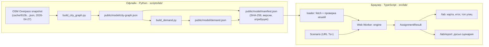

# Almaty Traffic Lab: технический дизайн

Статус: v1 · 2026-10-06 · дополняет [PLAN_ALMATY_TRAFFIC_LAB.md](PLAN_ALMATY_TRAFFIC_LAB.md)

## 1. Обзор



Принцип: данные, спрос и все тяжёлые неизменяемые вычисления готовятся офлайн и проверяются хешами. Браузер считает только равновесие для конкретного сценария.

## 2. Данные

### 2.1 Источник

Снимок OSM из Overpass в `cache/910b537a….json` (2026-04-27): 19 603 дороги, 673 светофора, теги `name`, `name:en`, `name:ru`, `lanes`, `maxspeed`, `oneway`. Охват: 76.74–77.21° в. д., 43.02–43.41° с. ш. Свежий снимок можно получить скриптом `scripts/lab/fetch_osm.py` (Overpass API), но сборка по умолчанию воспроизводима из закоммиченного снимка.

### 2.2 Сборка графа (`build_city_graph.py`, только stdlib)

1. **Фильтр классов:** `motorway, trunk, primary, secondary, tertiary` и их `_link`. Жилые улицы исключены: модель стратегического уровня, жилые улицы дадут ×5 размер без пользы для сценариев.
2. **Разбиение на рёбра:** путь (way) режется в узлах, которые разделяют ≥ 2 пути, на концах путей и на светофорах.
3. **Направления:** `oneway=yes|true|1` — прямое направление, `-1` — обратное, `junction=roundabout` — одностороннее, иначе два направления.
4. **Атрибуты ребра:**
   - `lanes`: `lanes:forward/backward`, иначе `lanes` (для двусторонних — `ceil(lanes/2)`), иначе значение по умолчанию для класса (`road_attributes.FALLBACK_LANES`).
   - `freeSpeed`: `maxspeed` (км/ч, `RU:urban` = 60), иначе значение по классу × 0.85 (городской коэффициент).
   - `capacityPerLane` (авт/ч): trunk 1800, primary 1700, secondary 1500, tertiary 1200, link 1300, motorway 1900.
   - `signal`: ребро заканчивается в узле со светофором.
5. **Сжатие цепочек:** узлы степени 2 (одна улица, без светофора, совпадающие атрибуты) удаляются, геометрия склеивается. Цель — < 12 000 направленных рёбер.
6. **Связность:** берётся крупнейшая сильно связная компонента (алгоритм Тарьяна, итеративный). Отброшенное фиксируется в манифесте.
7. **Улицы и секции:**
   - `street` = группа рёбер с одинаковым нормализованным именем. Английское имя: `name:en`, иначе транслитерация `name:ru`, иначе `name` (кириллица + казахские буквы → латиница).
   - `section` — единица выбора в интерфейсе. Улица режется на участки ~0.6–1.5 км в точках пересечения с другими значимыми улицами (trunk/primary/secondary). Подпись: «Abay Avenue · Baitursynov St → Masanchi St». Секция включает оба направления.
   - Безымянные рёбра (съезды) не выбираются как секции, но участвуют в расчёте.
8. **Геометрия для карты:** Douglas–Peucker с допуском 4 м, координаты квантуются до 1e-5° (≈1 м).

### 2.3 Формат `city-graph.json`

Колоночный, чтобы быстро грузиться в типизированные массивы:

```jsonc
{
  "schema": "almaty-traffic-lab/city-graph/v1",
  "source": { "osmTimestamp": "2026-04-27T13:12:05Z", "license": "ODbL-1.0" },
  "nodes": { "lon": [...], "lat": [...], "signal": [0,1,...] },
  "edges": {
    "from": [...], "to": [...],          // индексы узлов
    "length": [...],                      // м
    "freeSpeed": [...],                   // км/ч
    "lanes": [...],
    "capPerLane": [...],                  // авт/ч/полоса
    "cls": [...],                         // индекс в classes
    "street": [...],                      // индекс улицы или -1
    "section": [...],                     // индекс секции или -1
    "geom": [...]                         // плоский массив квантованных координат, смещения в geomOffset
  },
  "classes": ["trunk", "primary", ...],
  "streets": [{ "name": "Abay Avenue", "nameLocal": "Абай даңғылы" }],
  "sections": [{ "street": 12, "label": "Baitursynov St → Masanchi St", "lengthM": 1180, "edges": [..], "bbox": [..] }]
}
```

### 2.4 Спрос (`build_demand.py`)

1. **Зоны:** сетка 2 × 2 км по охвату графа. Остаются ячейки, в которых есть ≥ 1 узел графа. Ожидается ~60–80 зон.
2. **Генерация поездок** (proxy, явно помечено):
   - Производство `P_i ∝` длина жилых улиц в ячейке (из того же снимка OSM, класс `residential`). Это прокси плотности жилья.
   - Привлечение `A_j ∝` длина всех дорог в ячейке × деловой вес. Деловой вес — гауссово влияние существующих 7 зон (`data/zones/almaty_zones.json`, `kind=business`).
3. **Распределение:** гравитационная модель с ограничением по производству, `T_ij = P_i · A_j · exp(−β·t_ij) / Σ_k A_k·exp(−β·t_ik)`. `t_ij` — время в свободном потоке, `β = 0.1 1/мин`. Внутризонные поездки исключены (они не выходят на магистральную сеть).
4. **Масштаб:** суммарный пиковый поток подбирается так, чтобы в утренний пик средний V/C на магистралях был ≈ 0.75, а 8–12 % км сети имели V/C > 0.9. Это **калибровка на правдоподобие, не на наблюдения**, она отражается в манифесте и в «How much to trust this?».
5. **Периоды:** `am` (1.00), `midday` (0.65), `pm` (0.95, матрица транспонирована: поездки домой), `night` (0.15).
6. **Коннекторы:** у каждой зоны 3 ближайших узла графа в пределах ячейки. Поток зоны делится между ними поровну.
7. **Формат:** `demand.json` — зоны (центр, коннекторы), разреженная OD-матрица `am` (`[origin, dest, trips]`), множители периодов, вероятности назначения по строкам для новых объектов.

Exp и прочие трансцендентные функции считаются только офлайн. В браузере остаются +, −, ×, ÷ и целые степени, поэтому результаты совпадают во всех браузерах.

## 3. Движок (`src/lab/engine/`)

### 3.1 Структуры

- Граф в CSR: `outStart: Int32Array`, `outEdge: Int32Array`; атрибуты рёбер — `Float64Array`.
- Сценарий применяется как **патч** к копиям `capacity`, `freeTime`, `signalGreen`. Граф не перестраивается; закрытое ребро получает `closed[e] = 1` и пропускается в Дейкстре.

### 3.2 Функция задержки

```
t_e(v) = t0_e · (1 + 0.15 · (v / C_e)^4) + d_e
t0_e   = length / freeSpeed
C_e    = lanes · capPerLane · (signal ? g_e : 1)
d_e    = signal ? 0.5 · cycle · (1 − g_e)^2 : 0      // однородная задержка Вебстера, cycle = 90 с
g_e    = 0.5 по умолчанию (доля зелёного)
```

### 3.3 Распределение: Франк–Вульф

Целевая функция Бекмана. На каждой итерации:
1. Время рёбер по текущим потокам.
2. Дейкстра на бинарной куче (`Int32Array` + `Float64Array`) от каждой зоны-источника.
3. All-or-nothing загрузка по деревьям кратчайших путей.
4. Шаг λ — бисекция производной целевой функции (20 шагов).
5. Остановка по относительному разрыву `gap < 1e-3` или 60 итерациям.

Сценарий стартует с потоков базового равновесия (warm start), поэтому сходится за меньшее число итераций.

Бюджет времени: базовый расчёт ≤ 1.5 с, сценарий ≤ 1 с на ноутбуке. Измеряется тестом-бенчмарком.

### 3.4 Изменения (интервенции)

| `type` | Параметры | Патч |
|---|---|---|
| `close` | `section` | `closed = 1` для рёбер секции |
| `busLane` | `section` | `lanes −= 1` (недоступно при 1 полосе) |
| `addLane` | `section` | `lanes += 1` |
| `greenWave` | `section` | `g = 0.6` для сигнальных рёбер секции; у пересекающих рёбер в тех же узлах `g = 0.4` (честная цена) |
| `speedLimit` | `section`, `kmh` | `freeSpeed = min(freeSpeed, kmh)` |
| `development` | `lon, lat, kind, size` | Новые поездки из ближайшего узла и в него. Направления берутся по вероятностям ближайшей зоны. Пиковые коэффициенты: housing 0.35 поездки/кв. (am: 80 % выезд), office 0.4/сотрудника (am: 85 % въезд), mall 0.05/м² (am: 50/50) |

`Scenario = { v: 1, period: "am"|"midday"|"pm"|"night", changes: Change[] }`.

URL: `?s=` + base64url(JSON). Канонический JSON (отсортированные ключи) используется для хеша.

### 3.5 Показатели

- `avgTripMin` = Σ flow·time / Σ trips.
- `vehHours`, `vehKm`.
- `congestedKm` — длина рёбер с V/C > 0.9.
- `co2Kg` = Σ flow·len_km · (120 + 2200 / max(v, 5)) г/км. Простая кривая «чем медленнее, тем хуже», помечена как proxy.
- `unservedTrips` — пары OD без пути после закрытий.
- `streetDeltas` — по улицам: Δ потока (%), Δ времени проезда; топ-5 по |Δ|.
- `edgeDelta` — для карты разницы.

### 3.6 Воспроизводимость

```
scenarioHash = SHA-256(canonical({engine, dataHash, scenario}))
resultHash   = SHA-256(canonical(показатели, округлённые до 1e-6))
```

`engine` — версия движка (semver). `dataHash` — хеш манифеста. Отчёт показывает оба хеша; тест проверяет, что повтор даёт тот же `resultHash`.

## 4. Веб-приложение

| Маршрут | Назначение |
|---|---|
| `/` | Главная: вопрос, примеры, превью карты |
| `/lab` | Лаборатория (клиентская страница, карта на весь экран) |
| `/lab/report?s=` | Досье сценария, печать в PDF |
| `/methods` | Как устроена модель, простым языком |
| `/case/abay` | Старое досье Абая (архив методологии), ссылка из `/methods` |

- Карта: MapLibre + deck.gl `PathLayer` с `PathStyleExtension({ offset: true })`, чтобы направления рисовались рядом. Подложка OpenFreeMap `positron` (без ключей и лимитов), приглушённая.
- Состояние: `useReducer` + синхронизация в URL; Worker через `comlink`-подобную обёртку (свой маленький RPC без зависимостей).
- Старые API на `execFile('python3')` (`/api/trips`, `/api/analytics`, `/api/physics` и другие, завязанные на сервер) удаляются из публичной сборки. Страница песочницы удаляется.
- Деплой: Vercel, статическая генерация где возможно, данные в `public/model/` с длинным кэшем по хешу.

## 5. Дизайн-принципы (по языку Speqtr)

- Тёплый off-white фон, графитовый текст, **чёрная** главная кнопка, без фирменного цвета.
- Цвет тратится только на данные карты: последовательная шкала загрузки (нейтральный серый → охра → красный), для разницы — расходящаяся (сине-зелёный «легче» ↔ красный «тяжелее»).
- Иерархия через размер, насыщенность и 3–4 уровня серого. Тонкие линии вместо карточек и теней.
- Моноширинный шрифт для чисел, хешей и подписей (`01 · Pick a street`).
- Крупные лёгкие цифры для итога (`+5.2%`).
- Шаг сетки 8 px, поля 16/24/32.
- Никаких градиентов, свечения, эмодзи в интерфейсе (эмодзи из плана заменяются тонкими иконками одного веса).

## 6. Тестирование

| Уровень | Инструмент | Что проверяет |
|---|---|---|
| Данные | `unittest` (Python) | Связность, отсутствие NaN, ≥ 95 % секций с именами, размер файла < 2 МБ gzip, детерминизм сборки |
| Движок | `vitest` | Сохранение потока в узлах, сходимость (gap), монотонность BPR, «закрытие → поток на параллели», `greenWave` ухудшает пересекающие, детерминизм хешей, бюджет времени |
| UI | Playwright + axe | Флоу комиссии: главная → пример → запуск → результат → отчёт; мобильный вьюпорт; без нарушений доступности |
| CI | GitHub Actions | lint, tsc, vitest, unittest, build, e2e |

## 7. Что удаляется или архивируется

- `src/components/TrafficMap.tsx`, `src/app/sandbox`, API `trips`, `analytics`, `physics`, `traffic`, `operations`, `workflow`, `research-metrics`, `scenario-presets`.
- `@deck.gl/geo-layers` (источник 8 high-уязвимостей), если не нужен после удаления `TrafficMap`.
- Python-модули akimat, procurement, workflow, operations остаются в репозитории (их тесты продолжают проходить), но не участвуют в публичном интерфейсе.
