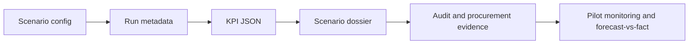
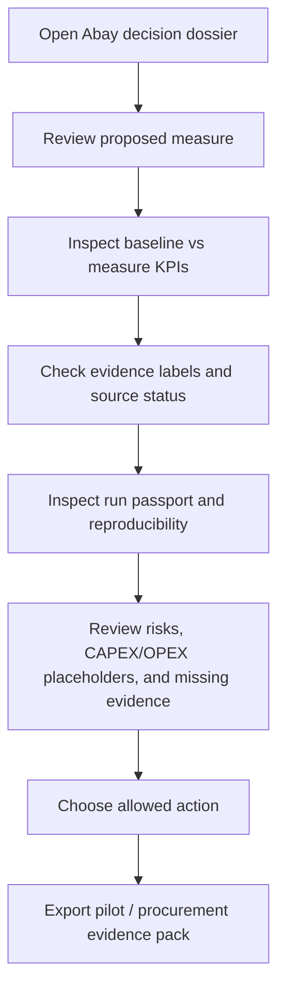
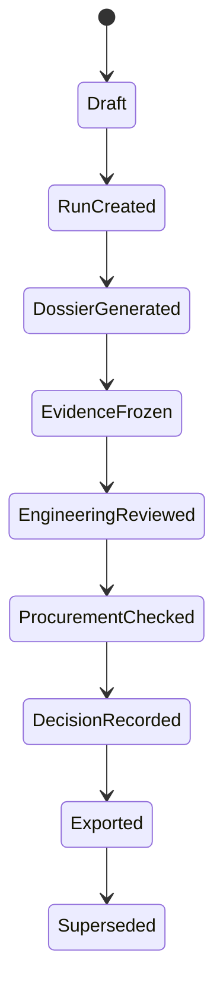

# Akimat Application Readiness Plan

## Executive Intent

The project should not be positioned to Almaty akimat as a generic traffic dashboard, AI toy, or city-scale control room.

Position it as:

> A reproducible evidence system for choosing, testing, and justifying corridor-level transport measures before budget approval, pilot launch, or procurement.

The first credible product artifact is an Evidence-Gated Scenario Dossier for [[First Corridor Pack - Abay]], implemented through [[G013 - Evidence-Gated Decision Workbench UI]].

## One-Sentence Pitch

> We do not ask akimat to trust a black-box model. We provide a reproducible decision dossier that shows the input data, assumptions, KPI deltas, evidence level, risks, cost placeholders, and next allowed action for a concrete Almaty corridor intervention.

## Strategic Framing

The buyer problem is not "how to view congestion on a map." The buyer problem is:

- Which corridor measure should leadership fund, defer, reject, or investigate further?
- What evidence supports that recommendation?
- Which data is real, proxy, calibrated, or missing?
- Can finance, procurement, engineers, and executives inspect the same decision trail?
- Can a pilot be launched with explicit success criteria and later compared against observed facts?

This maps to the project spine:

## External Evidence And Buyer Logic

Use these sources as the public-sector rationale behind the product narrative:

| Source | What it supports | How to use in pitch |
|---|---|---|
| Kazakhstan eGov public procurement portal | Public procurement requires electronic process visibility, reporting, equal competition, and reduced paper/document burden. | Say the platform generates structured evidence for internal review, tender preparation, and audit, not just visuals. |
| Kazakhstan Public Procurement Law, 2024 / 2025 updates | Procurement exists to support state functions and efficient management of public finances and budget. | Emphasize budget risk reduction and evidence-based selection of measures. |
| SMART ALMATY Strategy 2020-2025 | Smart-city projects should create resident value, use predictive analytics / IoT where useful, and involve private-sector cooperation. | Position the platform as a practical predictive-analytics pilot, not a vague smart-city promise. |
| FHWA traffic decision support practice | Strong traffic management follows monitor -> calculate/predict -> evaluate response -> execute/track. | Shape the workflow around decision stages and operational accountability. |
| UN ESCAP SUTI report for Almaty | Almaty has public transport strengths but gaps in updated data, monitoring, and investment planning. | Make "data readiness" and "what data akimat must provide next" a core screen. |
| World Bank / KGGTF Almaty-Tashkent smart mobility program | Smart mobility value comes from mobility database, response strategy, project selection methodology, pilot designs, and resilient public transport. | Frame the Abay dossier as a repeatable project selection method and pilot design artifact. |
| ITDP public transport principles | Good transport systems must be well-managed, well-funded, equitable, and service-quality oriented. | Avoid only car-speed metrics; include bus reliability, access, emissions, and public-service impact. |

## Product Shape For Akimat

The first screen should be:

`/scenarios/abay-signal-retiming/dossier`

It should read like a municipal decision file:

The map is supporting evidence, not the center of the product.

### Required Three-Panel Layout

| Area | Purpose | Required content |
|---|---|---|
| Left panel | Corridor and scenario context | Abay corridor, active scenario, alternative scenarios, current claim level, dossier status. |
| Center panel | Decision file | Recommendation, baseline vs measure KPI table, assumptions, limitations, source list, map evidence tab, lifecycle history. |
| Right panel | Trust and action | Evidence gate, blockers, allowed decisions, run passport summary, procurement/export status. |

## Minimum Functions Required For A Serious Akimat Application

### 1. Evidence-Gated Scenario Dossier

Must show:

- corridor and proposed measure
- decision question
- baseline vs measure summary
- KPI deltas
- assumptions
- data source list
- run passport
- limitations
- risks
- CAPEX/OPEX placeholders
- recommendation
- allowed decision actions

Acceptance:

- the UI reads from `reports/dossiers/abay-signal-retiming/dossier.json`
- every KPI row displays `claimLevel`
- every buyer-facing number has source, formula, and limitation visible or linked
- the screen never presents unconditional `fund` as the clean action while dossier remains `proxy`

### 2. Claim Labels As Product Logic

Use the existing labels from [[Claim Ledger]]:

| Label | UI behavior |
|---|---|
| `demo` | Show as workflow or prototype evidence only. |
| `proxy` | Allow `investigate further`, `defer`, or `fund conditional on evidence`; require missing-evidence list. |
| `calibrated` | Allow stronger planning language only with visible validation error and calibration source. |
| `real-data` | Show source owner, freshness, legal mode, and retention rule. |
| `procurement-ready` | Require run passport, limitations, reproducibility, acceptance evidence, sourced costs, and buyer-safe wording. |

Do not silently upgrade claims. Add evidence first, then update [[Claim Ledger]].

### 3. Run Passport And Reproducibility

Must show:

- run ID
- timestamp
- seed
- git hash or model version
- scenario parameters
- input files
- data source fingerprints
- output hashes
- limitations
- one-command reproduction path

Current evidence:

- `data/runs/abay-signal-retiming-run-passport.json`
- `reports/repro/abay/metadata.json`
- `reports/repro/abay/artifact_manifest.json`
- `simulation.config.json`

Acceptance:

- the UI exposes enough run metadata that an engineer can reproduce the dossier without reading source code
- the export pack includes the reproduction command and artifact manifest

### 4. KPI Comparison With Municipal Meaning

Minimum KPI groups:

- person-hours saved or lost
- corridor speed delta
- queue/load proxy
- bus reliability proxy
- emissions proxy
- CAPEX/OPEX placeholder
- ROI/payback proxy
- confidence / uncertainty

Do not over-index on private-car speed. For akimat credibility, include public transport reliability, access, emissions, and budget risk.

Acceptance:

- KPI names/units/formulas match [[G004 - Executive KPI Layer]]
- UI, API, dossier JSON, and CSV use the same KPI IDs
- each row shows formula, unit, baseline, measure, delta, claim level, and placeholder flag

### 5. Data Readiness Panel

The application should explicitly ask akimat for the data that upgrades the dossier.

Show:

- current real-data source: cached/imported road geometry snapshot
- current demo/proxy sources: generated traffic, proxy analytics, calibration assumptions, manual incident input
- missing sources: observed speed, detector counts, bus reliability, signal phase plans, incident logs, CAPEX/OPEX estimates, legal feed permissions
- upgrade path from `proxy` to `calibrated`

Acceptance:

- the screen has a "What we need from akimat" section
- each requested dataset has owner, reason, expected effect on claim level, and minimum viable format

### 6. Scenario Portfolio For Alternatives

Akimat should not see only one measure. The product should show that leadership can compare alternatives.

First alternatives:

- Abay signal retiming
- Abay bus priority
- Abay repair detour / capacity reduction
- no-build baseline

Acceptance:

- portfolio table ranks scenarios by effect, cost placeholder, confidence, and evidence readiness
- top candidate can open a dossier
- no scenario is marked stronger than its evidence

### 7. Procurement / Pilot Pack Export

Export should be a "pilot decision pack", not just a pretty PDF.

Pack contents:

- decision summary
- scenario config
- KPI JSON
- KPI CSV
- dossier HTML/Markdown
- run passport
- data source appendix
- risk register
- procurement/tender checklist
- reproduction metadata
- missing-evidence list
- pilot acceptance criteria

Acceptance:

- one button or route creates/links the current pack
- exported materials preserve claim labels and limitations
- export does not imply legal approval, e-signature, or procurement-ready status

### 8. Closed Decision Workflow

Use [[G008 - Closed Decision Workflow]] as the demo accountability model.

Minimum states:

Acceptance:

- user can see current status and artifact locks
- workflow history shows owner, timestamp, evidence path, hash, comments, next action
- UI clearly says current owners are demo strings until authenticated roles exist

### 9. Pilot Monitoring And Forecast-Vs-Fact

To move beyond a presentation, the application must define how a pilot will be judged.

Pilot acceptance criteria should include:

- before/after speed observations
- queue or load observations
- bus travel time / reliability
- incident and operations notes
- public-transport impact
- cost and delivery record
- forecast-vs-fact table
- recalibration trigger

Acceptance:

- dossier includes pilot success metrics
- workflow includes monitoring plan and post-audit comparison
- UI labels post-audit values as `demo` until observed field outcomes are attached

### 10. Deployment And Procurement Readiness

For selection weight, the application should show:

- local/on-prem run path
- Kazakhstan-approved hosting posture
- raw municipal data stays in city-controlled storage unless agreements permit otherwise
- backup/restore plan
- role model
- audit log design
- security scan plan
- SLA/support plan
- training and acceptance checklist

Current evidence:

- [[G009 - Enterprise And Procurement Readiness]]
- [[G012 - Reproducibility And Deployment]]
- `README_METHODS.md`
- `Dockerfile`
- `docker-compose.yml`
- `reports/procurement/tender_checklist.json`

Do not claim enterprise certification yet.

## What To Show In The Akimat Demo

### Demo Story

1. Open Abay corridor dossier.
2. Show the municipal decision question.
3. Show proposed signal retiming scenario.
4. Show baseline vs measure KPI deltas.
5. Open the evidence gate and explain `proxy`.
6. Show road geometry is `real-data` snapshot, while traffic and cost outputs remain proxy/demo.
7. Show what data akimat can provide to upgrade confidence.
8. Show run passport and reproducibility command.
9. Show decision actions: `defer`, `investigate further`, `fund conditional on evidence`.
10. Export pilot/procurement evidence pack.

### Demo Wording

Use:

> This is a decision-support and evidence system. It prepares a transparent dossier for transport measures and makes the assumptions, data sources, limitations, and budget risks inspectable.

Avoid:

> The AI proves this measure will solve congestion.

Use:

> The current Abay dossier is a proxy-level pilot artifact. With official speed, bus, signal, incident, and cost data, the same chain can be recalibrated and reviewed for stronger decisions.

Avoid:

> This is procurement-ready.

## Claim Boundary For The Application

Current safe claim:

> The prototype can generate a reproducible proxy-level Abay Scenario Dossier with run metadata, KPI deltas, source labels, limitations, workflow evidence, and procurement checklist artifacts.

Do not claim yet:

- live city feed integration
- calibrated city-wide accuracy
- legal approval workflow
- production SLA
- procurement-ready validation
- autonomous traffic control
- guaranteed congestion reduction

## Immediate Implementation Plan

### Stage 1 - Finish [[G013 - Evidence-Gated Decision Workbench UI]]

Files to touch first:

- `src/app/scenarios/abay-signal-retiming/dossier/page.tsx`
- `src/components/dossier/ClaimBadge.tsx`
- `src/components/dossier/EvidenceGate.tsx`
- `src/components/dossier/RunPassportCard.tsx`
- `src/components/dossier/KpiDeltaTable.tsx`
- `src/components/dossier/AssumptionList.tsx`
- `src/components/dossier/ProcurementReadinessPanel.tsx`
- `src/components/dossier/DecisionActionBar.tsx`
- `src/app/api/dossier/route.ts`

Acceptance:

- route builds and renders
- reads existing dossier artifact
- shows claim gates and missing evidence
- blocks unqualified fund wording
- `npm run lint` and `npm run build` pass
- browser screenshot saved under `reports/ui/`

### Stage 2 - Fix API Side Effects

Current problem: `GET /api/dossier` generates a dossier and returns a CLI summary.

Target:

- `GET /api/dossier` reads existing full dossier JSON
- `POST /api/dossiers` generates or refreshes dossier artifact
- future `POST /api/evidence-packs/freeze` freezes evidence
- any future production export mutation requires authenticated append-only custody; current procurement-pack POST is developer-only canonical bootstrap compatibility

Acceptance:

- `GET` is read-only
- `POST` side effects include actor placeholder, timestamp, input hash, output hash, claim level, limitations

### Stage 3 - Build Pilot / Procurement Export

Add a first export pack for Abay:

- dossier JSON/HTML/Markdown
- KPI CSV
- run passport
- provider registry
- artifact manifest
- procurement checklist
- workflow history
- missing evidence
- pilot criteria

Acceptance:

- export preserves claim labels
- export states current status is `demo` / `proxy`, not `procurement-ready`

### Stage 4 - Add Second Scenario Comparison

Use existing portfolio data:

- signal retiming
- bus priority
- repair detour

Acceptance:

- workbench can compare at least three scenario rows
- top candidate links to dossier
- values remain proxy unless upgraded

### Stage 5 - Raise Evidence Level With One Real Operational Dataset

Best next data targets:

- observed corridor speed CSV
- bus travel time / reliability feed
- signal phase plan
- detector/camera aggregate counts
- official CAPEX/OPEX estimates

Acceptance:

- one new source appears in provider registry
- run passport includes source freshness and legal mode
- KPI or calibration table uses the source
- claim upgrade is documented in [[Claim Ledger]] only if evidence supports it

## Application Package Checklist

Before submitting or presenting, prepare:

- one-page executive brief
- 8-10 slide pitch deck
- live demo route
- Abay pilot dossier PDF/HTML
- KPI CSV/JSON
- run passport
- procurement checklist
- data request memo for akimat
- 60-90 day pilot plan
- risk register
- local/on-prem deployment note
- claim boundary page

## Implementation Status - 2026-06-10

The first Abay Akimat application package is implemented as a reproducible `demo` / `proxy` pilot package. It is suitable for evidence-gated review and data-request conversations, not for stronger final acceptance language.

| Workstream | Status | Evidence |
|---|---|---|
| Akimat-facing decision workbench | implemented-verified | `/scenarios/abay-signal-retiming/dossier`, `reports/ui/abay-dossier-workbench.png` |
| Correct API boundaries | implemented-verified | immutable `GET /api/dossier` and procurement-pack GET; both POST boundaries are production-hidden and use one bounded canonical bootstrap only in explicit developer mode |
| Procurement / pilot pack export | implemented-verified | `reports/akimat/abay-signal-retiming/procurement_pack_index.json`, `application_package_index.json` |
| Scenario alternative comparison | implemented-verified | workbench portfolio panel plus `scenario_alternative_comparison.json` / `.md` |
| Data readiness / Akimat data request | implemented-verified | `data_readiness.json`, `data_request_memo.md`, `missing_evidence.json` |
| Pilot monitoring / forecast-vs-fact plan | implemented-verified | `pilot_monitoring_plan.json`, `pilot_monitoring_plan.md`, `pilot_acceptance_criteria.json` |
| Akimat application package | implemented-verified | `executive_brief.md`, `demo_script.md`, `slide_outline.md`, `risk_register.json`, `claim_boundary.md`, `local_onprem_deployment_note.md` |

Current safe claim remains:

> The prototype can generate a reproducible proxy-level Abay Scenario Dossier with run metadata, KPI deltas, source labels, limitations, workflow evidence, and procurement checklist artifacts.

## 60-90 Day Pilot Proposal

### Goal

Create a calibrated Abay corridor decision dossier and pilot-readiness pack for one transport measure.

### Inputs Needed From Akimat

- official corridor speed observations or traffic counts
- public transport travel time / reliability data for corridor
- current signal timing plan or summary
- incident / roadwork history if available
- cost assumptions for signal retiming or field works
- nominated data steward and transport engineer reviewer

### Deliverables

- calibrated or partially calibrated Abay dossier
- before/after KPI baseline
- pilot scenario comparison
- data provenance report
- procurement/pilot evidence pack
- monitoring plan
- forecast-vs-fact template

### Success Criteria

- every KPI has source, formula, and limitation
- at least one KPI is calibrated against observed local data
- akimat reviewers can reproduce or inspect the calculation chain
- decision action is documented as fund conditional, defer, reject, or request more evidence

## Agent Handoff

### 2026-06-15 AIA 2026 Premium Pitch Deck

- What changed: created and refreshed a 14-slide Russian pitch deck for Astana Innovations Accelerator 2026 under the public-facing name Almaty Mobility Lab. The deck is built around a simple jury-facing thesis: the platform checks road changes before street launch and produces a decision dossier. It uses schematic road/dossier visuals instead of raw app screenshots and replaces internal analytics vocabulary with simpler wording such as участок дороги, маршрут, дорожная ситуация, искусственный инцидент, вариант изменения, показатели, уровень доказательств, and досье решения.
- Files touched: `scripts/create_ain2026_pitch_deck.mjs`, `reports/pitch/almaty_mobility_lab_ain2026_pitch_deck.pptx`, `reports/pitch/almaty_mobility_lab_ain2026_pitch_deck.pptx.inspect.ndjson`, `/Users/kirill/Downloads/Almaty_Mobility_Lab_AIN2026_Pitch_Deck.pptx`, `/tmp/codex-presentations/manual-ain2026/almaty-mobility-lab/tmp/preview/`, `docs/obsidian/03-registries/Artifact Registry.md`.
- Verification: `node scripts/create_ain2026_pitch_deck.mjs`; `unzip -t reports/pitch/almaty_mobility_lab_ain2026_pitch_deck.pptx`; slide XML count is 14; speaker notes count is 14; preview PNG count is 14; final deck and Downloads copy have matching SHA-256 `d147f8bd9d8531e0be1f29bcc6563d0c3f1779298626342b42e3fe52d38d1497`; visible slide and notes text scan found none of the retired internal terms. Phrases about automatic traffic-light control, guaranteed effect, official deployment, and procurement readiness appear only under "Пока не заявляем".
- Generated artifacts/screenshots: `reports/pitch/almaty_mobility_lab_ain2026_pitch_deck.pptx`; `/Users/kirill/Downloads/Almaty_Mobility_Lab_AIN2026_Pitch_Deck.pptx`; `/tmp/codex-presentations/manual-ain2026/almaty-mobility-lab/tmp/preview/slide-01.png` through `slide-14.png`; `/tmp/codex-presentations/manual-ain2026/almaty-mobility-lab/tmp/preview/deck-montage.webp`.
- Unresolved risks: the deck remains a pitch artifact, not evidence of official data access, official city deployment, calibrated traffic performance, automatic signal control, guaranteed congestion reduction, or procurement readiness. The UI screenshots were intentionally avoided because the current app visual layer is not the submitted presentation asset.
- Claim labels changed: none. Pitch deck/application framing remains `demo`; Abay-style indicators remain `proxy`; no real-data claim was added beyond the existing road-geometry snapshot posture.
- Next action: review the deck in PowerPoint/Keynote for local font rendering, then use it as the AIA submission deck or export it to PDF after any final wording tweaks.

### 2026-06-10 Full Akimat Readiness Package

- What changed: implemented the full Abay readiness package around the G013 workbench. Added a reproducible Akimat pack generator, application/evidence indices, data request memo, missing evidence list, pilot acceptance criteria, forecast-vs-fact monitoring plan, executive brief, demo script, slide outline, risk register, claim boundary statement, local/on-prem deployment note, and updated scenario comparison. The procurement-pack API has since been hardened so GET is immutable-release-only and POST is production-hidden canonical-bootstrap compatibility.
- Files touched: `DESIGN.md`; `.omx/context/akimat-readiness-plan-20260610T162648Z.md`; `.omx/state/team-state.json`; `src/traffic_sim/akimat_pack.py`; `scripts/generate_akimat_application_pack.py`; `tests/test_akimat_pack.py`; `src/app/api/exports/procurement-pack/route.ts`; `src/app/scenarios/abay-signal-retiming/dossier/page.tsx`; `src/components/dossier/types.ts`; `reports/akimat/abay-signal-retiming/`; `reports/ui/abay-dossier-workbench.png`.
- Verification: original package generation and JSON checks passed; current route checks add immutable pack hash/alias tests, production GET headers and POST 404, developer canonical POST, full Python `100/100`, frontend contract, lint, typecheck and production build.
- Generated artifacts/screenshots: `reports/akimat/abay-signal-retiming/application_summary.md`; `application_summary.html`; `evidence_manifest.json`; `missing_evidence.json`; `pilot_acceptance_criteria.json`; `procurement_pack_index.json`; `data_request_memo.md`; `data_readiness.json`; `pilot_monitoring_plan.json`; `pilot_monitoring_plan.md`; `executive_brief.md`; `demo_script.md`; `slide_outline.md`; `risk_register.json`; `scenario_alternative_comparison.json`; `scenario_alternative_comparison.md`; `claim_boundary.md`; `local_onprem_deployment_note.md`; `application_package_index.json`; `reports/ui/abay-dossier-workbench.png`.
- Unresolved risks: no observed Akimat speed/count/bus/signal/incident/cost evidence is attached; no authenticated municipal roles or signed legal/security review; decision buttons still do not write an append-only decision record; the developer-only canonical regeneration path is not an authenticated production event ledger.
- Claim labels changed: none. Dossier and KPI deltas remain `proxy`; application pack remains `demo`; cached road geometry remains `real-data` snapshot.
- Next action: collect one Akimat-provided observed corridor dataset and implement append-only decision/freeze records before considering any claim upgrade.

### 2026-06-10 G013 Full Verification

- What changed: completed the full G013 implementation and verification loop for `/scenarios/abay-signal-retiming/dossier`. The workbench now reads the file-backed Abay evidence chain, keeps the map as supporting evidence, shows KPI deltas, run passport, data readiness, workflow custody, procurement gaps, and claim-gated actions, and blocks unqualified funding while the dossier remains `proxy`. The dossier generator and POST boundary were tightened so generated evidence and API responses use `fund_conditional_on_evidence`, input/output artifact paths, and SHA-256 hashes.
- Files touched: `src/app/scenarios/abay-signal-retiming/dossier/page.tsx`, `src/components/dossier/`, `src/app/api/dossier/route.ts`, `src/app/api/dossiers/route.ts`, `src/traffic_sim/dossier.py`, `tests/test_dossier.py`, `reports/dossiers/abay-signal-retiming/`, `data/runs/abay-signal-retiming-run-passport.json`, `reports/workflows/abay-signal-retiming-decision-workflow*`, `reports/repro/abay/`, `reports/ui/abay-dossier-workbench.png`, `docs/obsidian/01-goals/G013 - Evidence-Gated Decision Workbench UI.md`, `docs/obsidian/03-registries/Artifact Registry.md`.
- Verification: `PYTHONPATH=src python3 -m compileall -q src/traffic_sim scripts`; `python3 scripts/generate_dossier.py --config data/scenarios/dossier_abay_signal.json`; `PYTHONPATH=src python3 scripts/reproduce_dossier.py --config simulation.config.json --out reports/repro/abay`; `PYTHONPATH=src .venv/bin/python -m unittest discover -s tests` ran 36 tests; `PYTHONPATH=src python3 scripts/generate_decision_workflow.py --dossier reports/dossiers/abay-signal-retiming/dossier.json --out reports/workflows`; `npm run lint`; `npm run build`; curl smoke for `/scenarios/abay-signal-retiming/dossier`, `GET /api/dossier`, and `POST /api/dossiers` on port 3020; Browser smoke confirmed required sections, no forbidden phrases, no horizontal overflow, and disabled clean fund action.
- Generated artifacts/screenshots: `reports/ui/abay-dossier-workbench.png`; refreshed dossier JSON/Markdown/HTML/KPI CSV; refreshed run passport; refreshed workflow custody artifacts; refreshed reproduction pack with 21 manifest artifacts.
- Unresolved risks: no append-only decision record yet; no authenticated roles; no legal/source agreement for live feeds; no observed speed/count/bus/signal/incident evidence; no sourced CAPEX/OPEX; procurement/legal acceptance is not established.
- Claim labels changed: none.
- Next action: turn the workbench's visible action model into append-only decision/freeze/export POST boundaries, then prepare the akimat data request memo from the "What Akimat must provide" panel.

### 2026-06-10 G013 Implementation

- What changed: implemented the live Abay Evidence-Gated Decision Workbench route at `/scenarios/abay-signal-retiming/dossier` and fixed the dossier API boundary so `GET /api/dossier` reads the existing full dossier JSON. Added `POST /api/dossiers` as the explicit generation boundary for future side effects.
- Files touched: `src/app/scenarios/abay-signal-retiming/dossier/page.tsx`, `src/app/api/dossier/route.ts`, `src/app/api/dossiers/route.ts`, `src/components/dossier/`, `reports/ui/abay-dossier-workbench-g013.png`, `docs/obsidian/01-goals/G013 - Evidence-Gated Decision Workbench UI.md`, `docs/obsidian/03-registries/Artifact Registry.md`.
- Verification: `npm run lint`; `npm run build`; `curl -sS -I http://localhost:3016/scenarios/abay-signal-retiming/dossier`; `curl -sS http://localhost:3016/api/dossier | jq '{id, claimLevel, kpiRows: (.executiveKpis.kpis | length), hasTrustMetadata: (.trustMetadata != null)}'`.
- Generated artifact: `reports/ui/abay-dossier-workbench-g013.png`.
- Unresolved risks: workbench is still file-backed and demo-authored; current action buttons are evidence-gated display controls, not persisted decision records; akimat observed speed, bus reliability, signal plan, incident, legal feed, and cost inputs are still required for calibration.
- Claim labels changed: none.
- Next action: implement a decision freeze/export POST boundary and prepare a data request memo from the workbench's "What akimat must provide" section.

### 2026-06-10 Plan Creation

- What changed: created this Akimat application readiness plan from repo-local Obsidian strategy, current implementation audit, external best-practice research, and LLM Council synthesis.
- Files touched: `docs/obsidian/00-command-center/Akimat Application Readiness Plan.md`, `docs/obsidian/01-goals/G013 - Evidence-Gated Decision Workbench UI.md`, `docs/obsidian/00-command-center/Almaty Mobility Command Center.md`.
- Verification: markdown plan created; no code behavior changed; no claim level upgraded.
- Unresolved risks: source citations are planning context, not legal advice; procurement wording still needs local legal/procurement review before formal submission.
- Claim labels changed: none.
- Next action: implement [[G013 - Evidence-Gated Decision Workbench UI]] before expanding platform scope.
