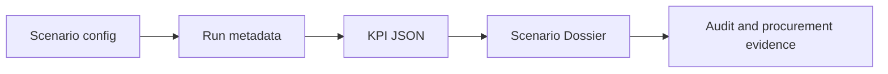

# Almaty Mobility Command Center

> [!important] Agent entry point
> Start here before changing project code. This vault layer is the operating system for the durable `.omx/ultragoal` plan, not a generic README.

## Active Objective

> [!note] 2026-10-06
> Current focus is [[G014 - Almaty Traffic Lab]]: a public, in-browser lab where reviewers pick any street and change it. The Abay dossier pipeline remains in the repo as the previous iteration.

Build the project from a working traffic demo into a procurement-ready municipal decision platform for Almaty akimat.

The first sellable epic is [[G002 - Scenario Dossier MVP]]: one corridor, baseline vs measure, executive KPIs, trust metadata, risks, CAPEX/OPEX placeholders, and exportable decision artifacts.

## Product Spine

Every implementation should strengthen this chain:

If a task does not improve one link in this chain, treat it as lower priority.

## Workbench

- [[AI Agent Operating Manual]]
- [[Obsidian Vault Contract]]
- [[Akimat Application Readiness Plan]]
- [[LLM Council - Implementation Audit]]
- [[LLM Council - UI Architecture Decision Workbench]]
- [[Artifact Registry]]
- [[Claim Ledger]]
- [[First Corridor Pack - Abay]]

## Goal Map

| Goal | Role in platform | Priority |
|---|---|---|
| [[G001 - Baseline MVP Inventory]] | Protect and label current demo truthfully | P0 |
| [[G002 - Scenario Dossier MVP]] | First sellable municipal artifact | P0 |
| [[G003 - ScenarioPortfolio And Batch Runner]] | Compare multiple measures | P1 |
| [[G004 - Executive KPI Layer]] | Translate simulation into budget language | P0 |
| [[G005 - Data Trust And Audit Layer]] | Make every result defensible | P0 |
| [[G006 - Municipal Scenario Library]] | Speak in city intervention terms | P1 |
| [[G007 - Operational Mode And Recommendations]] | Same-day operator decision support | P2 |
| [[G008 - Closed Decision Workflow]] | Scenario to approval to post-audit | P2 |
| [[G009 - Enterprise And Procurement Readiness]] | Tender and on-prem readiness | P2 |
| [[G010 - Real Data Integrations]] | Refreshable, attributable data sources | P1 |
| [[G011 - Research Metrics And Publication Visuals]] | Technical credibility and annexes | P3 |
| [[G012 - Reproducibility And Deployment]] | Clean-machine repeatability | P1 |
| [[G013 - Evidence-Gated Decision Workbench UI]] | Akimat-facing dossier screen and claim-gated decision workflow | P0 |
| [[G014 - Almaty Traffic Lab]] | Public in-browser lab for the university portfolio (current focus) | P0 |

## Embedded Bases

![[Almaty Goals.base]]

![[Almaty Council.base]]

## Decision Ceremony

The first platform demo should answer one buyer-shaped question:

> Which corridor scenario should leadership fund, defer, or investigate further?

Required artifacts for that ceremony:

- Corridor pack: [[First Corridor Pack - Abay]]
- Scenario dossier: [[G002 - Scenario Dossier MVP]]
- Executive KPI block: [[G004 - Executive KPI Layer]]
- Run passport and limitations: [[G005 - Data Trust And Audit Layer]]
- Reproduction path: [[G012 - Reproducibility And Deployment]]
- Akimat-facing workbench: [[G013 - Evidence-Gated Decision Workbench UI]]
- Claim levels: [[Claim Ledger]]

## Current Council Verdict

The council converged on one sharp recommendation:

> Build a defensible Abay or Al-Farabi Scenario Dossier before expanding into a broad platform story.

Expansion features like public narrative mode, decision knowledge graph, partner APIs, and full control-room operations are useful later, but they should not bury the first sellable epic.

## Current UI Architecture Plan

The UI council recommendation is captured in [[LLM Council - UI Architecture Decision Workbench]].

Next UI move:

> Build `/scenarios/abay-signal-retiming/dossier` as an Evidence-Gated Decision Workbench: dossier-first, map as evidence tab, explicit run/dossier/export side effects, claim-level gates, and a visible custody model for review, freeze, decision, and export.

The application/procurement positioning is captured in [[Akimat Application Readiness Plan]].

Current active implementation goal:

> [[G013 - Evidence-Gated Decision Workbench UI]] should turn the existing file-based Abay evidence chain into an akimat-facing decision dossier with KPI deltas, run passport, source limitations, evidence blockers, allowed actions, and export/procurement readiness.
