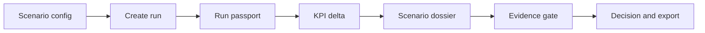

# G002 - Scenario Dossier MVP

## Council Verdict

This is the first sellable SKU. Do not treat it as a generic report generator. It must answer a municipal decision question: fund, defer, reject, or request more evidence.

## Implementation Move

Build a `ScenarioDossier` JSON/service contract first, then exports.

Minimum dossier sections:

- corridor and proposed measure
- baseline vs measure summary
- executive KPI deltas
- assumptions and source list
- data trust appendix
- risks and limitations
- CAPEX/OPEX placeholders
- recommendation and decision options

## UI Architecture Plan

Council source: [[LLM Council - UI Architecture Decision Workbench]].

The dossier UI should become an **Evidence-Gated Decision Workbench**, not a generic traffic dashboard.

First target screen:

`/scenarios/abay-signal-retiming/dossier`

This screen should read like a municipal decision file for [[First Corridor Pack - Abay]]:

- what is proposed
- baseline vs measure KPI delta
- source and limitation for every KPI
- current claim level
- run passport summary
- missing evidence
- CAPEX/OPEX placeholders
- recommendation
- allowed decision actions
- audit/procurement export status

The map should be a supporting evidence tab, not the default product center.

### Required Workbench Flow

### UI Components To Add

- `ClaimBadge`
- `EvidenceGate`
- `RunPassportCard`
- `KpiDeltaTable`
- `AssumptionList`
- `ProcurementReadinessPanel`
- `DecisionActionBar`

### API Boundary To Fix

For procurement trust, side effects should be explicit:

- `GET` reads existing artifacts.
- `POST /runs` creates a run.
- `POST /dossiers` generates or fixes a dossier version.
- `POST /evidence-packs/freeze` freezes evidence.
- `POST /exports/procurement-pack` creates an export.

Do not use a `GET` route as the primary way to generate new evidence.

### Evidence Gate Rule

Because the current [[Claim Ledger]] level for Scenario Dossier is `proxy`, the UI must not present immediate unqualified funding as the normal clean outcome.

Allowed actions at `proxy` level:

- `investigate further`
- `defer`
- `fund conditional on evidence`

Normal `fund` copy requires stronger evidence first.

## Files To Touch First

- `src/traffic_sim/dossier.py`
- `src/traffic_sim/web_app.py`
- `src/app/api/dossier/route.ts`
- `src/components/TrafficMap.tsx`
- `data/scenarios/dossier_abay_signal.json`
- `reports/dossiers/`

## Acceptance Gate

One dossier for [[First Corridor Pack - Abay]] exports Markdown/HTML and KPI CSV or XLSX-ready data, with run metadata and claim labels.

## Avoid

- Vague language like "traffic improved".
- Exporting charts without source and assumption links.
- Building PDF polish before the JSON contract is stable.

## Evidence Links

- [[First Corridor Pack - Abay]]
- [[G004 - Executive KPI Layer]]
- [[G005 - Data Trust And Audit Layer]]
- [[G012 - Reproducibility And Deployment]]
- [[LLM Council - Implementation Audit]]
- [[LLM Council - UI Architecture Decision Workbench]]
- `data/scenarios/dossier_abay_signal.json`
- `reports/dossiers/abay-signal-retiming/dossier.json`
- `reports/dossiers/abay-signal-retiming/dossier.md`
- `reports/dossiers/abay-signal-retiming/dossier.html`
- `reports/dossiers/abay-signal-retiming/kpis.csv`
- `src/app/api/dossier/route.ts`
- [[LLM Council - Jury Pitch Deck Structure]]

## Agent Handoff

### 2026-06-15 Jury Pitch Deck Structure

- What changed: created a Russian-language council synthesis for a jury-facing presentation structure. The structure frames AMDP as a way to check one city decision before expensive implementation, anchored on the Abay signal-retiming dossier and current claim boundaries.
- Files touched: `docs/obsidian/02-council/LLM Council - Jury Pitch Deck Structure.md`; `docs/obsidian/03-registries/Artifact Registry.md`; `docs/obsidian/01-goals/G002 - Scenario Dossier MVP.md`.
- Verification: source notes reviewed from the required project start sequence, [[G002 - Scenario Dossier MVP]], [[Claim Ledger]], [[First Corridor Pack - Abay]], the Akimat package notes, and `/Users/kirill/Downloads/AMDP Product Audit 2026.md`; no code behavior changed.
- Generated artifact: [[LLM Council - Jury Pitch Deck Structure]].
- Unresolved risks: the structure is ready for slide production, but no `.pptx`, PDF, or visual slide deck has been created yet. Timing for a real-data pilot should not be promised unless data access and reviewers are confirmed.
- Claim labels changed: none. Presentation wording must keep dossier/KPI values at `proxy`, package at `demo`, and road geometry as a `real-data` snapshot.
- Next action: turn the 10-slide structure into a visual deck using simple Russian wording, one Abay screenshot/map, a table of claim levels, and a final slide with real-data pilot requirements.

### 2026-06-11 Presentation Dashboard Visual Pass

- What changed: strengthened the first sellable Abay dossier path with a meeting-first one-screen dashboard at `/scenarios/abay-signal-retiming/dossier`. The route now presents scenario config context, Abay corridor map, KPI proxy values, evidence gate, CAPEX estimate, and gated decision action as one visual dossier screen.
- Files touched: `src/app/scenarios/abay-signal-retiming/dossier/page.tsx`; `src/components/dossier/AbayCorridorMap.tsx`; `src/components/dossier/AbayCorridorMap.module.css`; `reports/ui/abay-dossier-presentation-dashboard.png`; `docs/obsidian/01-goals/G002 - Scenario Dossier MVP.md`; `docs/obsidian/01-goals/G013 - Evidence-Gated Decision Workbench UI.md`; `docs/obsidian/03-registries/Artifact Registry.md`.
- Verification: `npm run lint`; `npm run build`; Browser smoke on `http://localhost:3012/scenarios/abay-signal-retiming/dossier`; screenshot artifact saved at `reports/ui/abay-dossier-presentation-dashboard.png`.
- Generated artifact: `reports/ui/abay-dossier-presentation-dashboard.png` (presentation screenshot).
- Unresolved risks: the screen is optimized for a meeting visual, not for displaying every audit/procurement detail in the route. Observed speeds/counts, bus reliability, signal timing, incident history, and sourced CAPEX/OPEX remain missing.
- Claim labels changed: none. Dossier values remain `proxy`; OSM road snapshot remains `real-data`; no `procurement-ready` claim.
- Next action: keep the single-screen visual for meetings, but maintain a separate deep evidence view or export for audit/procurement review before procurement conversations advance.

### 2026-06-05 Checkpoint

- What changed: implemented the first file-based Abay Scenario Dossier path: scenario config -> run passport -> executive KPI JSON -> dossier exports -> audit/procurement evidence. Added a lightweight Next API wrapper for dossier generation.
- Files touched: `data/scenarios/dossier_abay_signal.json`, `src/traffic_sim/dossier.py`, `scripts/generate_dossier.py`, `src/app/api/dossier/route.ts`, `reports/dossiers/abay-signal-retiming/dossier.json`, `reports/dossiers/abay-signal-retiming/dossier.md`, `reports/dossiers/abay-signal-retiming/dossier.html`, `reports/dossiers/abay-signal-retiming/kpis.csv`, `data/runs/abay-signal-retiming-run-passport.json`, `docs/obsidian/01-goals/G002 - Scenario Dossier MVP.md`, `docs/obsidian/03-registries/Artifact Registry.md`, `docs/obsidian/03-registries/Claim Ledger.md`, `docs/obsidian/03-registries/First Corridor Pack - Abay.md`, `docs/obsidian/00-command-center/First Epic Execution Plan.md`.
- Verification: `PYTHONPATH=src python3 -m compileall -q src/traffic_sim scripts` passed; `python3 scripts/generate_dossier.py --config data/scenarios/dossier_abay_signal.json` passed; `python3 -m json.tool` passed for config, dossier JSON, and run passport; KPI CSV has 12 rows; regenerated passport and dossier both carry `proxy` dossier claim; `npm run lint` passed; `npm run build` passed; `curl http://localhost:3010/api/dossier` passed against `PORT=3010 npm run dev`; in-app Browser smoke loaded `/` and captured `/tmp/almaty-dossier-smoke-root.png`.
- Recommendation generated: `defer`, because proxy benefits appear positive but claim level is not strong enough for immediate funding.
- Unresolved risks: FastAPI smoke remains blocked by missing `fastapi`; in-app Browser blocked raw `/api/dossier` navigation with `net::ERR_BLOCKED_BY_CLIENT` although `curl` passed; the dashboard emitted duplicate React key warnings for `node_7929`; dossier HTML is simple Markdown-in-HTML, not polished PDF; CAPEX/OPEX and ROI are placeholders/proxies.
- Claim labels changed: Scenario Dossier moved from not implemented to `proxy`; no procurement-ready claim.
- Evidence links: `reports/dossiers/abay-signal-retiming/dossier.md`; `reports/dossiers/abay-signal-retiming/dossier.json`; `reports/dossiers/abay-signal-retiming/kpis.csv`.
- Next action: gather stronger observed/cost evidence or polish buyer-facing dossier export; keep claim level at `proxy` until validation data and sourced CAPEX/OPEX are attached.

### 2026-06-06 UI Architecture Council Plan

- What changed: captured the UI architecture council verdict as an actionable plan. The first UI implementation should be an Evidence-Gated Decision Workbench anchored on the Abay signal-retiming dossier, not a map-first dashboard.
- Files touched: `docs/obsidian/02-council/LLM Council - UI Architecture Decision Workbench.md`, `docs/obsidian/01-goals/G002 - Scenario Dossier MVP.md`, `docs/obsidian/01-goals/G008 - Closed Decision Workflow.md`, `docs/obsidian/00-command-center/Almaty Mobility Command Center.md`.
- Verification: Obsidian note structure uses wikilinks; no code behavior changed; no claim level upgraded.
- Unresolved risks: lifecycle permissions, evidence freeze, stale KPI handling, authenticated roles, bilingual institutional wording, and procurement handoff still need implementation before any `procurement-ready` wording.
- Claim labels changed: none. Scenario Dossier remains `proxy`; procurement packet remains `demo`.
- Next action: implement or wireframe `/scenarios/abay-signal-retiming/dossier` with `ClaimBadge`, `EvidenceGate`, `RunPassportCard`, `KpiDeltaTable`, `ProcurementReadinessPanel`, and a decision action bar that blocks unqualified `fund` while the dossier remains `proxy`.

### 2026-08-11 - Portfolio-Ready Controlled Dossier Release

- What changed: replaced the active Abay signal-retiming shortcut with a versioned controlled pair (`36 s -> 32 s`) generated from one source series and one exact aggregate-demand control (`500 -> 500`). The dossier now verifies the selected pair, carries the source primitive count (`1,950`), explicit no-scaling limitation and occupancy proxy (`1.0`), rebuilds KPI values, serializes the M1-M5/E1-E3 recommendation evidence, binds its run passport to the immutable release ID, and keeps the proxy outcome at `request_more_evidence`.
- Files touched: `simulation.config.json`; `src/traffic_sim/config.py`; `src/traffic_sim/paired_experiment.py`; `src/traffic_sim/dossier.py`; `src/traffic_sim/executive_kpis.py`; `src/traffic_sim/reproducibility.py`; `data/scenarios/dossier_abay_signal.json`; `data/fixtures/abay/`; `schemas/paired-experiment-result.schema.json`; `tests/test_paired_experiment.py`; `tests/test_dossier.py`; `tests/test_reproducibility.py`; `reports/portfolio/current.json` and its immutable run.
- Verification: full Python suite `100/100` passed; source slice `35/35` with 13 hashes; repeated releases preserved semantic fingerprint `238e11b8064368a138057c3545144bd1ae00ccf7ce807b0cdcf7c985150ec8c2` and a canonically identical KPI block; current route manifest validates 11 route artifacts and 43 closed aliases; independent code review returned `APPROVE` and architecture review returned `CLEAR`.
- Generated artifacts: promoted dossier JSON/Markdown/HTML/KPI CSV; paired-experiment result and analytics variants; run passport; reproduction, workflow, research, procurement and Akimat evidence packs; canonical screenshot `docs/assets/abay-dossier-portfolio.png`.
- Unresolved risks: signal delays, aggregate demand effects, emissions and economic values remain transparent proxies; CAPEX/OPEX remain placeholders; no observed signal plan, OD routes, controller feasibility or forecast-versus-fact evidence is attached.
- Claim labels changed: none. Scenario dossier and KPI values remain `proxy`; workflow/package evidence remains `demo`; imported road geometry remains a non-live `real-data` snapshot.
- Next action: attach observed Abay counts/travel times, current signal timing, bus reliability and sourced costs, then run a preregistered calibration/holdout review before considering any claim upgrade.

### 2026-08-14 - Portfolio v0.1.0 Technical Specification Approved

- What changed: created the complete next-stage technical specification for turning the existing controlled Abay dossier into an English-only, accessible, secure and reproducible university portfolio release. The mandatory lane remains a single curated `proxy` case; empirical calibration is isolated as optional `v0.2` work.
- Files touched: `.omx/plans/portfolio-idealization-technical-specification.md`; `.omx/plans/portfolio-idealization-traceability.md`; `docs/obsidian/01-goals/G002 - Scenario Dossier MVP.md`; `docs/obsidian/01-goals/G012 - Reproducibility And Deployment.md`; `docs/obsidian/01-goals/G013 - Evidence-Gated Decision Workbench UI.md`; `docs/obsidian/03-registries/Artifact Registry.md`.
- Verification: direct read-only current verification passed for run `abay-20260811T213919Z-a112cc6222` with 11 route artifacts and 43 aliases; source verification passed 35/35 required paths and 13 hashes while honestly retaining `trackedProof=pending_git_authorization`; requirement traceability covers every normative ID with no duplicates or omissions; independent final review returned `APPROVE` with no blocking findings.
- Generated artifact: the implementation-ready portfolio specification plus its requirement-to-test/evidence appendix.
- Unresolved risks: no product behavior changed in this planning task. The public UI is still Russian, eight high-severity production dependency findings remain, public CI/license/tag provenance is absent, and the container is not yet a clean-clone release proof.
- Claim labels changed: none. Dossier/KPI evidence remains `proxy`; application/workflow evidence remains `demo`; road geometry remains a non-live `real-data` snapshot.
- Next action: execute M0 baseline freeze and owner-decision register, then M1 English dossier-first shell: `<html lang="en">`, `/` redirect to dossier, `/sandbox` split/disclaimer, shared English navigation, English map labels and rendered-DOM language regression.

### 2026-08-15 - Portfolio Presentation System Finalised

- What changed: completed the dossier-first visual layer specified for the first sellable Abay epic. The public case is now an English editorial evidence dossier with the controlled `36 s → 32 s` comparison, proxy KPI ledger, explicit evidence gaps, immutable downloads and a supporting map. The demo sandbox is visually separated, clearly labelled, responsive and free of overlapping panels while preserving time-aware route playback through an interpolated trail window. Mobile controls collapse into normal document flow; the full non-live disclaimer and adjacent `demo`/`proxy` labels are mandatory.
- Files touched: `.stitch/`; shared app shell/states; dossier page and components; sandbox page and presentation CSS; `src/components/tripTrail.mjs`; `tests/trip_trail_animation.mjs`; `tests/portfolio_m3_quality.mjs`; `scripts/verify-public-routes.sh`; `docs/assets/abay-dossier-portfolio.png`; `reports/portfolio/current.json`; this note; [[G013 - Evidence-Gated Decision Workbench UI]]; [[Artifact Registry]].
- Verification: lint, TypeScript, build, English/download/frontend/docs/trip-trail contracts, source/current verification, production route/download smoke, four responsive widths, three browsers, zero Axe violations, privacy, print/PDF and visible desktop/mobile inspection passed. The mobile disclosure and 44 px application targets are enforced by the browser gate. Current immutable run: `abay-20260815T053423Z-cf0d2671a3`.
- Generated artifact: canonical screenshot `docs/assets/abay-dossier-portfolio.png` (1440×900; SHA-256 `5838b1e4ab72ad12bbe09535462ad2fe29ef1bd2101067ea254e7e24dccc3fcb`) plus refreshed M3 browser evidence.
- Unresolved risks: presentation quality is complete for the current portfolio scope, but scientific and procurement authority is unchanged: no observed corridor validation, controller-feasibility proof, sourced economics or authenticated decision record.
- Claim labels changed: none. The case remains `proxy`; application/workflow evidence remains `demo`; road geometry remains a non-live `real-data` snapshot.
- Next action: preserve this visual baseline and invest next in observed-data validation and release governance, not additional dashboard features.

### 2026-08-15 - Fresh End-to-End Simulation and Workflow QA

- What changed: added a fresh adversarial QA record covering the actual simulation engine, current-worktree reproducibility, promoted dossier/download path, visible desktop/mobile sandbox interactions, cross-browser quality gate, decision workflow and production API boundaries. Product behavior and claim levels were not changed.
- Files touched: `.omx/evidence/portfolio-fresh-end-to-end-qa-20260815.md`; `docs/obsidian/01-goals/G002 - Scenario Dossier MVP.md`; `docs/obsidian/01-goals/G008 - Closed Decision Workflow.md`; `docs/obsidian/03-registries/Artifact Registry.md`.
- Verification: 106/106 Python tests; two identical isolated current-worktree bootstraps; all 121 allowed signal-delay values; lint/typecheck/build/contracts; 15/15 production routes; visible Chromium download/playback/scrub/reset/split/mobile journey; 390/768/1280/1440, Chromium/Firefox/WebKit and Axe 0/0; full isolated seven-state workflow and negative/concurrency cases.
- Generated artifact: `.omx/evidence/portfolio-fresh-end-to-end-qa-20260815.md` plus refreshed `reports/qa/m3-browser-quality.json` (SHA-256 `57ca3ae4a2e9b62b5154100c80576c01a524132bfe6ca5002570ec05d05f0239`).
- Unresolved risks: completed simulations with zero active vehicles fail analytics validation; immediate vehicle spawn can exceed road capacity; workflow evidence can be a directory or later become stale; workflow/operations GET routes mutate files and their production APIs lack authentication/path/body/write hardening. Scientific calibration, clean release provenance and passing container security remain absent.
- Claim labels changed: none. Dossier and KPI values remain `proxy`; workflow/application remains `demo`; road geometry remains a non-live `real-data` snapshot.
- Next action: fix the two engine invariants and production workflow/operations boundaries before calling the sandbox a reliable simulation; then repeat this entire matrix and only afterward address clean/tagged release governance and observed-data calibration.
