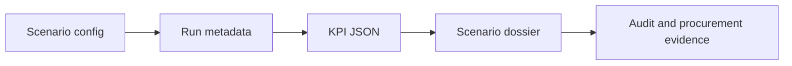
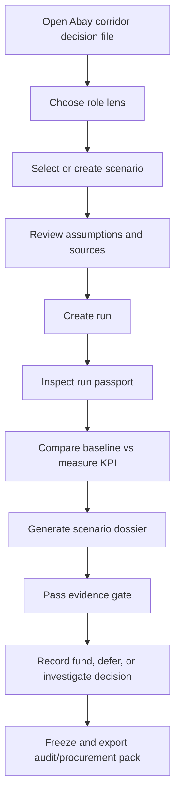
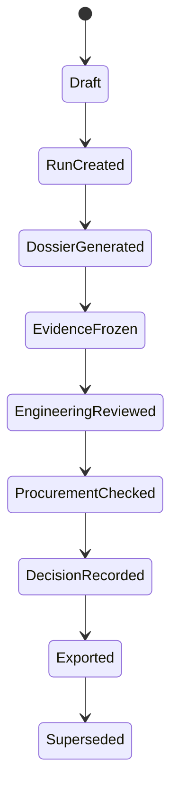

# LLM Council - UI Architecture Decision Workbench

Question sent to the council:

> How should the product UI architecture and user flow work for a serious Almaty akimat mobility decision tool, while keeping [[G002 - Scenario Dossier MVP]] as the first sellable epic?

## Council Verdict

Build an **Evidence-Gated Decision Workbench**, not a generic traffic dashboard.

The first screen should not be the map. The first screen should be a municipal decision file for [[First Corridor Pack - Abay]]:

> Abay corridor -> scenario -> evidence level -> recommendation -> risks -> missing evidence -> next allowed action

The map is a supporting evidence view, not the product center.

## Product Spine For UI

Every UI flow should strengthen this chain:

Do not build broad platform UI unless it improves this chain for the first Abay dossier.

## Information Architecture

### 1. Corridor Portfolio

Purpose: choose the municipal decision context.

For each corridor, show:

- active scenarios
- current evidence level
- readiness for decision
- latest dossier
- missing evidence
- audit/procurement pack status

First anchor: [[First Corridor Pack - Abay]].

### 2. Scenario Workbench

Purpose: let planners and engineers form a checkable scenario, not merely tune a simulation.

Required sections:

- proposed measure
- scenario parameters
- assumptions
- source list
- run metadata
- claim labels
- limitations

### 3. Decision And Evidence Room

Purpose: let executives, procurement, audit, and data stewards inspect what can be defended.

Required sections:

- recommendation
- baseline vs measure comparison
- KPI deltas with sources and limitations
- run passport
- CAPEX/OPEX placeholders
- evidence gate
- missing evidence
- decision options
- export pack

## Primary User Flow

## Role Lenses

Use role lenses over the same dossier, not separate unrelated screens.

| Role | Primary view |
|---|---|
| Executive sponsor | decision, recommendation, risks, next allowed action |
| Transport planner | scenario parameters, assumptions, corridor context |
| Traffic engineer | run passport, KPI math, limitations, operational feasibility |
| Data steward | source provenance, freshness, legal/source status, claim level |
| Procurement analyst | evidence pack, checklist, cost placeholders, audit trail |
| Sysadmin/security | deployment posture, permissions, logs, reproducibility |

## Evidence Gate Rules

Claim labels must be product logic, not decorative badges.

- `demo`: show as workflow demonstration only.
- `proxy`: allow `investigate further`, `defer`, or `fund conditional on evidence`; do not present normal immediate funding as a clean outcome.
- `calibrated`: allow stronger recommendation if validation error is visible.
- `real-data`: show provenance, freshness, legal status, and source owner.
- `procurement-ready`: require run passport, limitations, reproducibility, acceptance evidence, and buyer-safe wording.

Every KPI card or table row must display:

- source
- claim level
- limitation
- freshness or generated timestamp
- link to evidence

## UI Layout Pattern

Use a three-panel workbench for desktop municipal users:

- left: corridor/scenario tree
- center: dossier, compare, map, assumptions, or evidence view
- right: trust and action panel with evidence level, blockers, next action, decision gate, export

The visual style should be restrained and institutional: dense but readable, audit-forward, no marketing hero, no decorative control-room theatrics.

## API And Side-Effect Rules

For procurement trust, side effects must be explicit.

- `GET` reads existing artifacts.
- `POST /runs` creates a run.
- `POST /dossiers` generates or fixes a dossier version.
- `POST /evidence-packs/freeze` freezes evidence.
- `POST /exports/procurement-pack` creates an export.

Each side-effecting action must store:

- actor or owner
- timestamp
- input hash
- output hash
- scenario version
- claim level
- limitations

## Lifecycle And Accountability Model

The workbench needs a dossier state model before polish:

Open questions for implementation:

- Who can create a run?
- Who can freeze a dossier?
- Who can downgrade a claim?
- Who can attach counter-evidence?
- What happens when planner, engineer, and procurement disagree?
- How does stale KPI JSON or an expired evidence pack block export?

## Implementation Plan

1. Build one ideal screen first: `/scenarios/abay-signal-retiming/dossier`.
2. Make the screen read like a decision file: recommendation, evidence level, KPI deltas, run passport, limitations, missing evidence, allowed actions.
3. Add reusable components:
   - `ClaimBadge`
   - `EvidenceGate`
   - `RunPassportCard`
   - `KpiDeltaTable`
   - `AssumptionList`
   - `ProcurementReadinessPanel`
   - `DecisionActionBar`
4. Split generation from reading:
   - `GET` routes for reading existing artifacts
   - `POST` routes for run/dossier/evidence/export creation
5. Add role-lens copy and controls without forking the source dossier.
6. Add lifecycle states and audit metadata from [[G008 - Closed Decision Workflow]].
7. Only then polish map, export, and portfolio screens.

## One Thing To Do First

Design and implement the first Abay dossier screen as an auditable municipal decision file:

`/scenarios/abay-signal-retiming/dossier`

This screen should answer:

- What is proposed?
- What changed in the KPI comparison?
- What evidence supports it?
- What cannot be claimed yet?
- Who reviewed or froze the evidence?
- What decision is allowed today?

## Related Notes

- [[G002 - Scenario Dossier MVP]]
- [[G004 - Executive KPI Layer]]
- [[G005 - Data Trust And Audit Layer]]
- [[G008 - Closed Decision Workflow]]
- [[G009 - Enterprise And Procurement Readiness]]
- [[G012 - Reproducibility And Deployment]]
- [[Claim Ledger]]
- [[Artifact Registry]]
- [[First Corridor Pack - Abay]]
